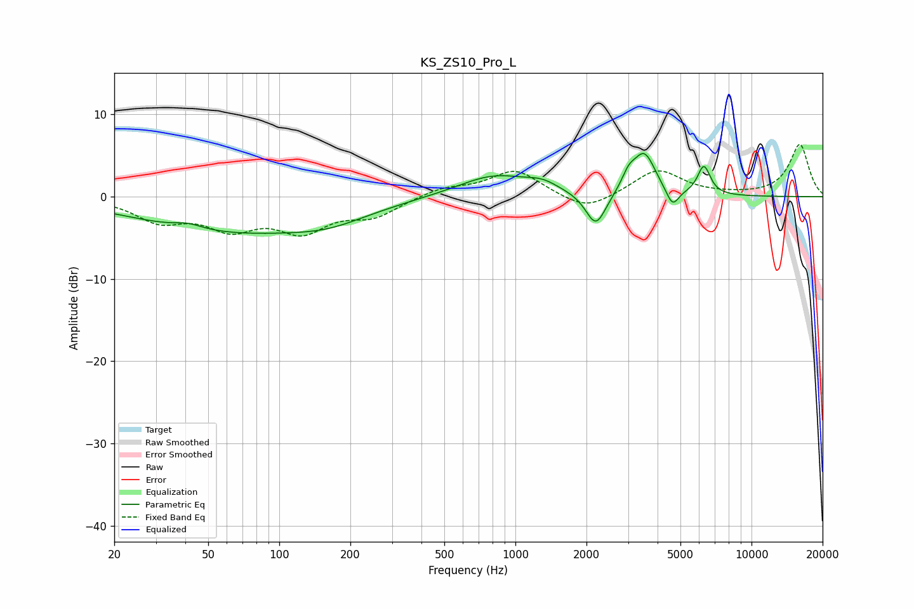

# KS_ZS10_Pro_L
See [usage instructions](https://github.com/jaakkopasanen/AutoEq#usage) for more options and info.

### Parametric EQs
Apply preamp of -5.3 dB when using parametric equalizer.

|   # | Type    |   Fc (Hz) |    Q |   Gain (dB) |
|-----|---------|-----------|------|-------------|
|   1 | Peaking |        41 | 2.42 |         0.6 |
|   2 | Peaking |        64 | 0.34 |        -4.2 |
|   3 | Peaking |       162 | 0.9  |        -1.3 |
|   4 | Peaking |       817 | 0.9  |         2.7 |
|   5 | Peaking |      1304 | 2.2  |         0.9 |
|   6 | Peaking |      2192 | 3.28 |        -4.2 |
|   7 | Peaking |      3019 | 4.82 |         1.7 |
|   8 | Peaking |      3517 | 2.95 |         5   |
|   9 | Peaking |      4627 | 5.25 |        -2.2 |
|  10 | Peaking |      6285 | 5.12 |         3.5 |

### Fixed Band EQs
When using fixed band (also called graphic) equalizer, apply preamp of **-6.4 dB** (if available) and set gains manually with these parameters.

|   # | Type    |   Fc (Hz) |    Q |   Gain (dB) |
|-----|---------|-----------|------|-------------|
|   1 | Peaking |        31 | 1.41 |        -2.7 |
|   2 | Peaking |        62 | 1.41 |        -3.3 |
|   3 | Peaking |       125 | 1.41 |        -3.7 |
|   4 | Peaking |       250 | 1.41 |        -2.1 |
|   5 | Peaking |       500 | 1.41 |         1.1 |
|   6 | Peaking |      1000 | 1.41 |         3.2 |
|   7 | Peaking |      2000 | 1.41 |        -1.9 |
|   8 | Peaking |      4000 | 1.41 |         3.3 |
|   9 | Peaking |      8000 | 1.41 |         0.1 |
|  10 | Peaking |     16000 | 1.41 |         6.3 |

### Graphs

