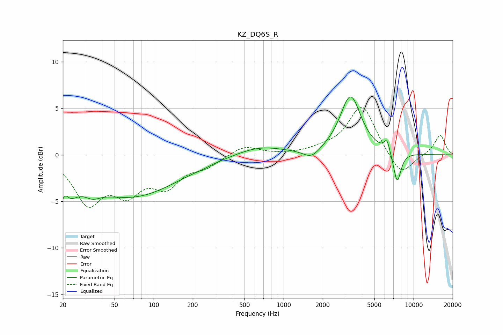

# KZ_DQ6S_R
See [usage instructions](https://github.com/jaakkopasanen/AutoEq#usage) for more options and info.

### Parametric EQs
Apply preamp of -6.3 dB when using parametric equalizer.

|   # | Type    |   Fc (Hz) |    Q |   Gain (dB) |
|-----|---------|-----------|------|-------------|
|   1 | Peaking |        20 | 2.03 |        -4.5 |
|   2 | Peaking |        21 | 4.78 |         1.9 |
|   3 | Peaking |        34 | 2.39 |        -0.8 |
|   4 | Peaking |        68 | 0.39 |        -4.4 |
|   5 | Peaking |       237 | 2.21 |        -0.1 |
|   6 | Peaking |       650 | 0.78 |         1   |
|   7 | Peaking |      1639 | 2.2  |        -1   |
|   8 | Peaking |      3270 | 1.77 |         6.3 |
|   9 | Peaking |      6246 | 6    |         1.4 |
|  10 | Peaking |      7479 | 4.54 |        -3.3 |

### Fixed Band EQs
When using fixed band (also called graphic) equalizer, apply preamp of **-5.2 dB** (if available) and set gains manually with these parameters.

|   # | Type    |   Fc (Hz) |    Q |   Gain (dB) |
|-----|---------|-----------|------|-------------|
|   1 | Peaking |        31 | 1.41 |        -4.9 |
|   2 | Peaking |        62 | 1.41 |        -3.4 |
|   3 | Peaking |       125 | 1.41 |        -3   |
|   4 | Peaking |       250 | 1.41 |        -1.1 |
|   5 | Peaking |       500 | 1.41 |         1   |
|   6 | Peaking |      1000 | 1.41 |         0   |
|   7 | Peaking |      2000 | 1.41 |         0.4 |
|   8 | Peaking |      4000 | 1.41 |         5.4 |
|   9 | Peaking |      8000 | 1.41 |        -2.5 |
|  10 | Peaking |     16000 | 1.41 |         2.2 |

### Graphs

