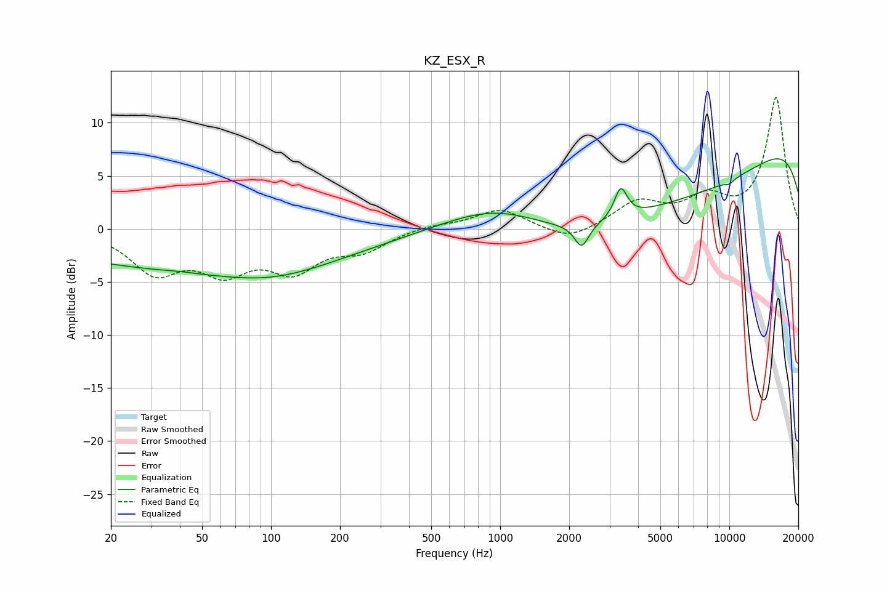

# KZ_ESX_R
See [usage instructions](https://github.com/jaakkopasanen/AutoEq#usage) for more options and info.

### Parametric EQs
Apply preamp of -6.7 dB when using parametric equalizer.

|   # | Type    |   Fc (Hz) |    Q |   Gain (dB) |
|-----|---------|-----------|------|-------------|
|   1 | Peaking |        39 | 2.62 |         0.1 |
|   2 | Peaking |        50 | 0.19 |        -3.7 |
|   3 | Peaking |       100 | 0.65 |        -1.1 |
|   4 | Peaking |       992 | 0.6  |         3.6 |
|   5 | Peaking |      2267 | 4.62 |        -2.2 |
|   6 | Peaking |      3361 | 5.1  |         2.9 |
|   7 | Peaking |      4827 | 0.22 |        -8.2 |
|   8 | Peaking |     10000 | 0.18 |         3.8 |
|   9 | Peaking |     10000 | 0.18 |         7.4 |
|  10 | Peaking |     10000 | 5.95 |        -0.3 |

### Fixed Band EQs
When using fixed band (also called graphic) equalizer, apply preamp of **-12.5 dB** (if available) and set gains manually with these parameters.

|   # | Type    |   Fc (Hz) |    Q |   Gain (dB) |
|-----|---------|-----------|------|-------------|
|   1 | Peaking |        31 | 1.41 |        -3.8 |
|   2 | Peaking |        62 | 1.41 |        -3.5 |
|   3 | Peaking |       125 | 1.41 |        -3.5 |
|   4 | Peaking |       250 | 1.41 |        -1.8 |
|   5 | Peaking |       500 | 1.41 |         0.4 |
|   6 | Peaking |      1000 | 1.41 |         1.9 |
|   7 | Peaking |      2000 | 1.41 |        -1.3 |
|   8 | Peaking |      4000 | 1.41 |         2.4 |
|   9 | Peaking |      8000 | 1.41 |         2.5 |
|  10 | Peaking |     16000 | 1.41 |        12.3 |

### Graphs

