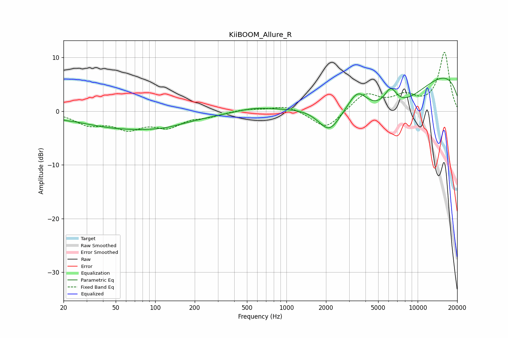

# KiiBOOM_Allure_R
See [usage instructions](https://github.com/jaakkopasanen/AutoEq#usage) for more options and info.

### Parametric EQs
Apply preamp of -6.3 dB when using parametric equalizer.

|   # | Type    |   Fc (Hz) |    Q |   Gain (dB) |
|-----|---------|-----------|------|-------------|
|   1 | Peaking |        21 | 4.54 |        -0.1 |
|   2 | Peaking |        59 | 2.15 |         0   |
|   3 | Peaking |        68 | 0.36 |        -3.4 |
|   4 | Peaking |       120 | 1.31 |        -0.3 |
|   5 | Peaking |       565 | 1.05 |         0.7 |
|   6 | Peaking |      2124 | 1.62 |        -5   |
|   7 | Peaking |      3487 | 2.07 |         3.3 |
|   8 | Peaking |      6219 | 2.72 |         3.7 |
|   9 | Peaking |      6324 | 0.47 |        -8.5 |
|  10 | Peaking |     10000 | 0.2  |         9.5 |

### Fixed Band EQs
When using fixed band (also called graphic) equalizer, apply preamp of **-11.1 dB** (if available) and set gains manually with these parameters.

|   # | Type    |   Fc (Hz) |    Q |   Gain (dB) |
|-----|---------|-----------|------|-------------|
|   1 | Peaking |        31 | 1.41 |        -2.3 |
|   2 | Peaking |        62 | 1.41 |        -2.9 |
|   3 | Peaking |       125 | 1.41 |        -2.6 |
|   4 | Peaking |       250 | 1.41 |        -0.8 |
|   5 | Peaking |       500 | 1.41 |         0.4 |
|   6 | Peaking |      1000 | 1.41 |         1.1 |
|   7 | Peaking |      2000 | 1.41 |        -3.5 |
|   8 | Peaking |      4000 | 1.41 |         3.3 |
|   9 | Peaking |      8000 | 1.41 |         2.4 |
|  10 | Peaking |     16000 | 1.41 |        10.9 |

### Graphs

