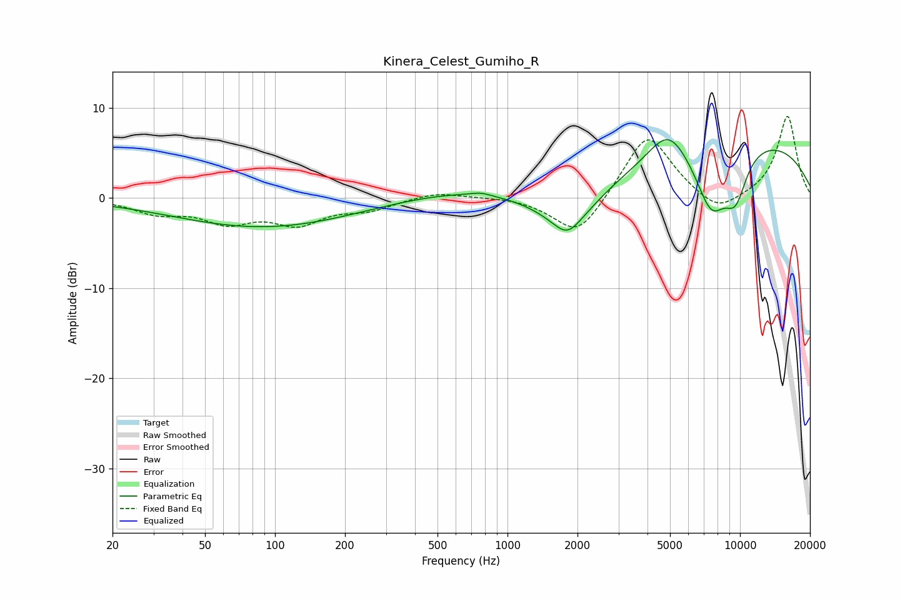

# Kinera_Celest_Gumiho_R
See [usage instructions](https://github.com/jaakkopasanen/AutoEq#usage) for more options and info.

### Parametric EQs
Apply preamp of -6.5 dB when using parametric equalizer.

|   # | Type    |   Fc (Hz) |    Q |   Gain (dB) |
|-----|---------|-----------|------|-------------|
|   1 | Peaking |        90 | 0.37 |        -3.3 |
|   2 | Peaking |       631 | 0.52 |         1   |
|   3 | Peaking |       770 | 3.63 |         0.3 |
|   4 | Peaking |      1804 | 2.77 |        -1.5 |
|   5 | Peaking |      1840 | 1.07 |        -4.2 |
|   6 | Peaking |      4909 | 1.67 |         3.6 |
|   7 | Peaking |      7516 | 1.83 |        -6.9 |
|   8 | Peaking |      7920 | 1.68 |        -0.2 |
|   9 | Peaking |      9573 | 2.46 |        -4.8 |
|  10 | Peaking |     10000 | 0.26 |         6.8 |

### Fixed Band EQs
When using fixed band (also called graphic) equalizer, apply preamp of **-9.1 dB** (if available) and set gains manually with these parameters.

|   # | Type    |   Fc (Hz) |    Q |   Gain (dB) |
|-----|---------|-----------|------|-------------|
|   1 | Peaking |        31 | 1.41 |        -1.5 |
|   2 | Peaking |        62 | 1.41 |        -2.4 |
|   3 | Peaking |       125 | 1.41 |        -2.6 |
|   4 | Peaking |       250 | 1.41 |        -1.1 |
|   5 | Peaking |       500 | 1.41 |         0.7 |
|   6 | Peaking |      1000 | 1.41 |         0.2 |
|   7 | Peaking |      2000 | 1.41 |        -4.5 |
|   8 | Peaking |      4000 | 1.41 |         7.4 |
|   9 | Peaking |      8000 | 1.41 |        -2.1 |
|  10 | Peaking |     16000 | 1.41 |         9.1 |

### Graphs

