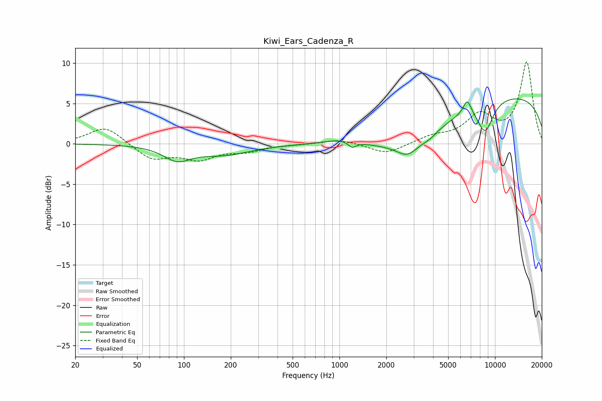

# Kiwi_Ears_Cadenza_R
See [usage instructions](https://github.com/jaakkopasanen/AutoEq#usage) for more options and info.

### Parametric EQs
Apply preamp of -5.7 dB when using parametric equalizer.

|   # | Type    |   Fc (Hz) |    Q |   Gain (dB) |
|-----|---------|-----------|------|-------------|
|   1 | Peaking |        90 | 1.63 |        -1.7 |
|   2 | Peaking |       181 | 0.81 |        -1.3 |
|   3 | Peaking |       978 | 1.68 |         0.4 |
|   4 | Peaking |      1208 | 5.85 |        -0.7 |
|   5 | Peaking |      2737 | 2.31 |        -1.3 |
|   6 | Peaking |      2996 | 0.62 |        -4   |
|   7 | Peaking |      3798 | 3.49 |        -0.3 |
|   8 | Peaking |      6637 | 5.21 |         1.8 |
|   9 | Peaking |      8649 | 2.54 |        -3.8 |
|  10 | Peaking |      9928 | 0.18 |         6.3 |

### Fixed Band EQs
When using fixed band (also called graphic) equalizer, apply preamp of **-10.2 dB** (if available) and set gains manually with these parameters.

|   # | Type    |   Fc (Hz) |    Q |   Gain (dB) |
|-----|---------|-----------|------|-------------|
|   1 | Peaking |        31 | 1.41 |         2.2 |
|   2 | Peaking |        62 | 1.41 |        -1.9 |
|   3 | Peaking |       125 | 1.41 |        -1.7 |
|   4 | Peaking |       250 | 1.41 |        -0.8 |
|   5 | Peaking |       500 | 1.41 |        -0.1 |
|   6 | Peaking |      1000 | 1.41 |         0.6 |
|   7 | Peaking |      2000 | 1.41 |        -1.3 |
|   8 | Peaking |      4000 | 1.41 |         0.8 |
|   9 | Peaking |      8000 | 1.41 |         3.3 |
|  10 | Peaking |     16000 | 1.41 |        10   |

### Graphs

