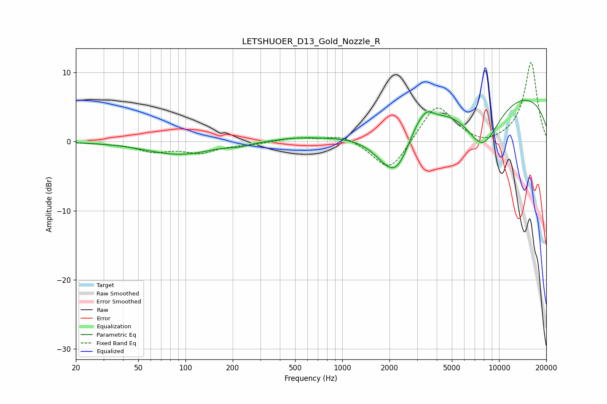

# LETSHUOER_D13_Gold_Nozzle_R
See [usage instructions](https://github.com/jaakkopasanen/AutoEq#usage) for more options and info.

### Parametric EQs
Apply preamp of -6.1 dB when using parametric equalizer.

|   # | Type    |   Fc (Hz) |    Q |   Gain (dB) |
|-----|---------|-----------|------|-------------|
|   1 | Peaking |        89 | 0.7  |        -1.8 |
|   2 | Peaking |       120 | 1.6  |        -0.1 |
|   3 | Peaking |       219 | 2.37 |        -0.4 |
|   4 | Peaking |       506 | 0.96 |         0.4 |
|   5 | Peaking |      2080 | 1.2  |        -6.8 |
|   6 | Peaking |      2309 | 2.25 |        -1.6 |
|   7 | Peaking |      3021 | 2.66 |         1.2 |
|   8 | Peaking |      3473 | 3.61 |         1.3 |
|   9 | Peaking |      7849 | 1.13 |        -7.7 |
|  10 | Peaking |      9024 | 0.18 |         7.9 |

### Fixed Band EQs
When using fixed band (also called graphic) equalizer, apply preamp of **-11.5 dB** (if available) and set gains manually with these parameters.

|   # | Type    |   Fc (Hz) |    Q |   Gain (dB) |
|-----|---------|-----------|------|-------------|
|   1 | Peaking |        31 | 1.41 |        -0.2 |
|   2 | Peaking |        62 | 1.41 |        -1.3 |
|   3 | Peaking |       125 | 1.41 |        -1.5 |
|   4 | Peaking |       250 | 1.41 |        -0.3 |
|   5 | Peaking |       500 | 1.41 |         0.5 |
|   6 | Peaking |      1000 | 1.41 |         1.1 |
|   7 | Peaking |      2000 | 1.41 |        -4.6 |
|   8 | Peaking |      4000 | 1.41 |         5.6 |
|   9 | Peaking |      8000 | 1.41 |        -0.9 |
|  10 | Peaking |     16000 | 1.41 |        11.5 |

### Graphs

