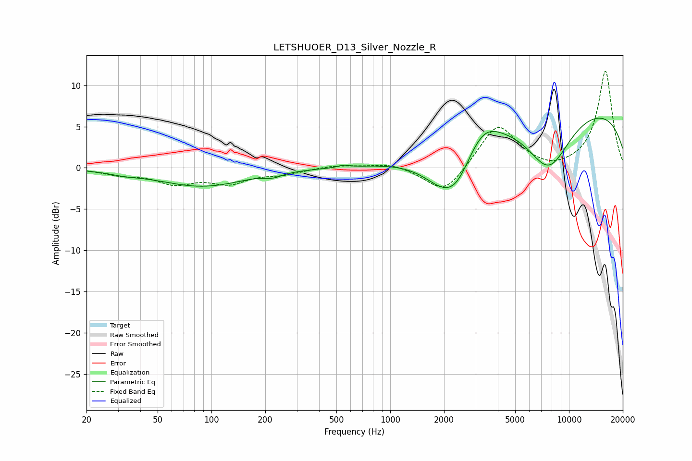

# LETSHUOER_D13_Silver_Nozzle_R
See [usage instructions](https://github.com/jaakkopasanen/AutoEq#usage) for more options and info.

### Parametric EQs
Apply preamp of -6.1 dB when using parametric equalizer.

|   # | Type    |   Fc (Hz) |    Q |   Gain (dB) |
|-----|---------|-----------|------|-------------|
|   1 | Peaking |        33 | 1.71 |        -0.3 |
|   2 | Peaking |        89 | 0.58 |        -2.2 |
|   3 | Peaking |       209 | 1.36 |         0.3 |
|   4 | Peaking |       220 | 2.58 |        -0.6 |
|   5 | Peaking |       547 | 4.7  |         0.3 |
|   6 | Peaking |      2080 | 1.07 |        -5.7 |
|   7 | Peaking |      2389 | 2.04 |        -1.5 |
|   8 | Peaking |      3302 | 1.63 |         2.4 |
|   9 | Peaking |      7697 | 1.04 |        -7.3 |
|  10 | Peaking |      9262 | 0.18 |         7.9 |

### Fixed Band EQs
When using fixed band (also called graphic) equalizer, apply preamp of **-11.8 dB** (if available) and set gains manually with these parameters.

|   # | Type    |   Fc (Hz) |    Q |   Gain (dB) |
|-----|---------|-----------|------|-------------|
|   1 | Peaking |        31 | 1.41 |        -0.7 |
|   2 | Peaking |        62 | 1.41 |        -1.7 |
|   3 | Peaking |       125 | 1.41 |        -1.7 |
|   4 | Peaking |       250 | 1.41 |        -0.6 |
|   5 | Peaking |       500 | 1.41 |         0.3 |
|   6 | Peaking |      1000 | 1.41 |         0.6 |
|   7 | Peaking |      2000 | 1.41 |        -3.3 |
|   8 | Peaking |      4000 | 1.41 |         5.4 |
|   9 | Peaking |      8000 | 1.41 |        -0.6 |
|  10 | Peaking |     16000 | 1.41 |        11.8 |

### Graphs

