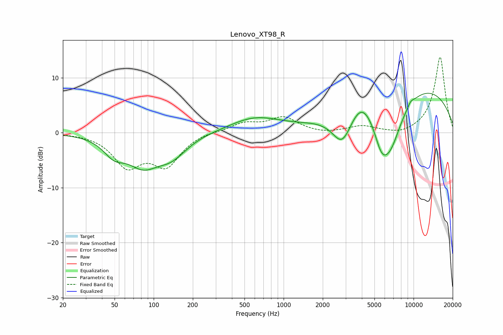

# Lenovo_XT98_R
See [usage instructions](https://github.com/jaakkopasanen/AutoEq#usage) for more options and info.

### Parametric EQs
Apply preamp of -7.3 dB when using parametric equalizer.

|   # | Type    |   Fc (Hz) |    Q |   Gain (dB) |
|-----|---------|-----------|------|-------------|
|   1 | Peaking |        49 | 1.76 |        -2.8 |
|   2 | Peaking |        82 | 1.16 |        -4.9 |
|   3 | Peaking |       137 | 1.19 |        -3.5 |
|   4 | Peaking |       601 | 0.74 |         2.6 |
|   5 | Peaking |      2831 | 1.8  |        -6   |
|   6 | Peaking |      3956 | 1.54 |         3.5 |
|   7 | Peaking |      5647 | 2.48 |        -4.4 |
|   8 | Peaking |      6578 | 1.33 |        -9.6 |
|   9 | Peaking |      9487 | 5.39 |         0.7 |
|  10 | Peaking |      9609 | 0.26 |         9   |

### Fixed Band EQs
When using fixed band (also called graphic) equalizer, apply preamp of **-13.8 dB** (if available) and set gains manually with these parameters.

|   # | Type    |   Fc (Hz) |    Q |   Gain (dB) |
|-----|---------|-----------|------|-------------|
|   1 | Peaking |        31 | 1.41 |        -0   |
|   2 | Peaking |        62 | 1.41 |        -5.7 |
|   3 | Peaking |       125 | 1.41 |        -5.6 |
|   4 | Peaking |       250 | 1.41 |         0.3 |
|   5 | Peaking |       500 | 1.41 |         1.6 |
|   6 | Peaking |      1000 | 1.41 |         2.7 |
|   7 | Peaking |      2000 | 1.41 |        -0.3 |
|   8 | Peaking |      4000 | 1.41 |         1.1 |
|   9 | Peaking |      8000 | 1.41 |        -0.6 |
|  10 | Peaking |     16000 | 1.41 |        13.8 |

### Graphs

