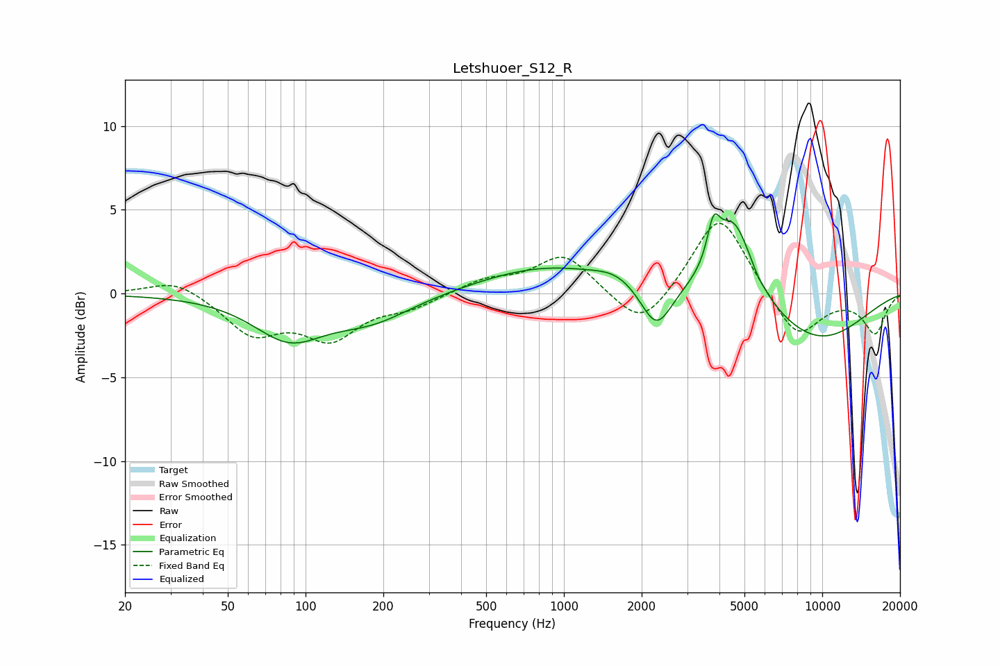

# Letshuoer_S12_R
See [usage instructions](https://github.com/jaakkopasanen/AutoEq#usage) for more options and info.

### Parametric EQs
Apply preamp of -4.9 dB when using parametric equalizer.

|   # | Type    |   Fc (Hz) |    Q |   Gain (dB) |
|-----|---------|-----------|------|-------------|
|   1 | Peaking |        80 | 1.44 |         0.4 |
|   2 | Peaking |        85 | 1.08 |        -2.8 |
|   3 | Peaking |       180 | 0.87 |        -1.5 |
|   4 | Peaking |       855 | 0.55 |         1.6 |
|   5 | Peaking |      1600 | 1.69 |         0.6 |
|   6 | Peaking |      2281 | 2.35 |        -2.7 |
|   7 | Peaking |      3794 | 5.95 |         2.2 |
|   8 | Peaking |      4534 | 1.82 |         5.1 |
|   9 | Peaking |      5625 | 6    |        -0.2 |
|  10 | Peaking |      9408 | 0.6  |        -2.9 |

### Fixed Band EQs
When using fixed band (also called graphic) equalizer, apply preamp of **-4.3 dB** (if available) and set gains manually with these parameters.

|   # | Type    |   Fc (Hz) |    Q |   Gain (dB) |
|-----|---------|-----------|------|-------------|
|   1 | Peaking |        31 | 1.41 |         0.9 |
|   2 | Peaking |        62 | 1.41 |        -2.3 |
|   3 | Peaking |       125 | 1.41 |        -2.5 |
|   4 | Peaking |       250 | 1.41 |        -0.7 |
|   5 | Peaking |       500 | 1.41 |         0.8 |
|   6 | Peaking |      1000 | 1.41 |         2.3 |
|   7 | Peaking |      2000 | 1.41 |        -2.4 |
|   8 | Peaking |      4000 | 1.41 |         4.9 |
|   9 | Peaking |      8000 | 1.41 |        -2.8 |
|  10 | Peaking |     16000 | 1.41 |        -2.3 |

### Graphs

