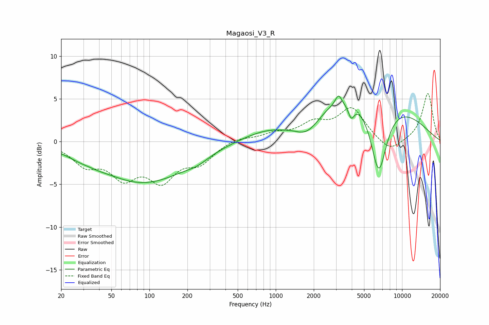

# Magaosi_V3_R
See [usage instructions](https://github.com/jaakkopasanen/AutoEq#usage) for more options and info.

### Parametric EQs
Apply preamp of -5.4 dB when using parametric equalizer.

|   # | Type    |   Fc (Hz) |    Q |   Gain (dB) |
|-----|---------|-----------|------|-------------|
|   1 | Peaking |        28 | 1.57 |        -0.4 |
|   2 | Peaking |        39 | 2.12 |        -0.2 |
|   3 | Peaking |        90 | 0.4  |        -4.8 |
|   4 | Peaking |       239 | 1.65 |        -0.5 |
|   5 | Peaking |      1125 | 1.38 |        -0.5 |
|   6 | Peaking |      1770 | 1.19 |        -3.4 |
|   7 | Peaking |      3136 | 5.95 |         1.2 |
|   8 | Peaking |      3957 | 5.88 |        -1.6 |
|   9 | Peaking |      4001 | 0.25 |         6.3 |
|  10 | Peaking |      6535 | 2.05 |        -8.7 |

### Fixed Band EQs
When using fixed band (also called graphic) equalizer, apply preamp of **-5.7 dB** (if available) and set gains manually with these parameters.

|   # | Type    |   Fc (Hz) |    Q |   Gain (dB) |
|-----|---------|-----------|------|-------------|
|   1 | Peaking |        31 | 1.41 |        -2.4 |
|   2 | Peaking |        62 | 1.41 |        -3.6 |
|   3 | Peaking |       125 | 1.41 |        -4   |
|   4 | Peaking |       250 | 1.41 |        -2.2 |
|   5 | Peaking |       500 | 1.41 |         0.5 |
|   6 | Peaking |      1000 | 1.41 |         0.8 |
|   7 | Peaking |      2000 | 1.41 |         1.9 |
|   8 | Peaking |      4000 | 1.41 |         3.7 |
|   9 | Peaking |      8000 | 1.41 |        -1.4 |
|  10 | Peaking |     16000 | 1.41 |         5.7 |

### Graphs

