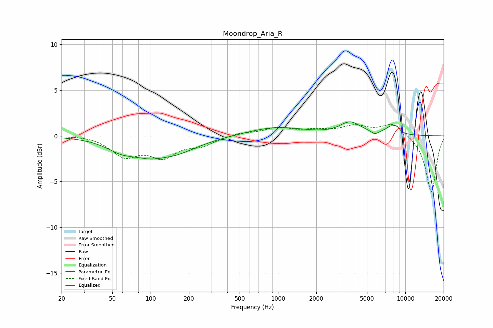

# Moondrop_Aria_R
See [usage instructions](https://github.com/jaakkopasanen/AutoEq#usage) for more options and info.

### Parametric EQs
Apply preamp of -1.6 dB when using parametric equalizer.

|   # | Type    |   Fc (Hz) |    Q |   Gain (dB) |
|-----|---------|-----------|------|-------------|
|   1 | Peaking |        58 | 1.36 |        -0.8 |
|   2 | Peaking |       119 | 0.65 |        -2.6 |
|   3 | Peaking |       127 | 2.04 |         0.3 |
|   4 | Peaking |       435 | 1.11 |         0   |
|   5 | Peaking |       963 | 0.65 |         0.9 |
|   6 | Peaking |      3167 | 1.46 |        -0.2 |
|   7 | Peaking |      3645 | 1.6  |         1.6 |
|   8 | Peaking |      5745 | 5.45 |        -0.4 |
|   9 | Peaking |      7697 | 2.95 |         0.8 |
|  10 | Peaking |      8583 | 5.72 |         0.5 |

### Fixed Band EQs
When using fixed band (also called graphic) equalizer, apply preamp of **-1.3 dB** (if available) and set gains manually with these parameters.

|   # | Type    |   Fc (Hz) |    Q |   Gain (dB) |
|-----|---------|-----------|------|-------------|
|   1 | Peaking |        31 | 1.41 |         0.1 |
|   2 | Peaking |        62 | 1.41 |        -2.1 |
|   3 | Peaking |       125 | 1.41 |        -2.1 |
|   4 | Peaking |       250 | 1.41 |        -0.9 |
|   5 | Peaking |       500 | 1.41 |         0.3 |
|   6 | Peaking |      1000 | 1.41 |         0.8 |
|   7 | Peaking |      2000 | 1.41 |         0.5 |
|   8 | Peaking |      4000 | 1.41 |         1   |
|   9 | Peaking |      8000 | 1.41 |         1.4 |
|  10 | Peaking |     16000 | 1.41 |        -6.2 |

### Graphs

