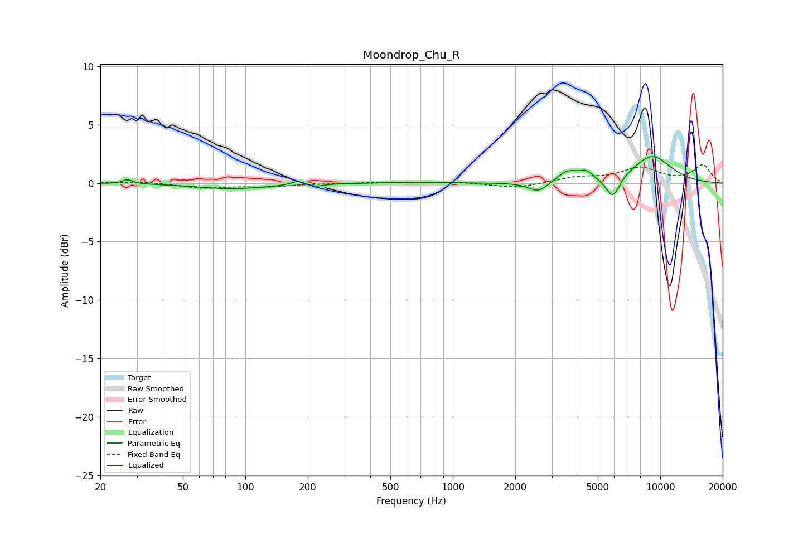

# Moondrop_Chu_R
See [usage instructions](https://github.com/jaakkopasanen/AutoEq#usage) for more options and info.

### Parametric EQs
Apply preamp of -2.4 dB when using parametric equalizer.

|   # | Type    |   Fc (Hz) |    Q |   Gain (dB) |
|-----|---------|-----------|------|-------------|
|   1 | Peaking |        27 | 5.95 |         0.4 |
|   2 | Peaking |        86 | 0.83 |        -0.5 |
|   3 | Peaking |       179 | 4.71 |         0.4 |
|   4 | Peaking |       219 | 4.5  |        -0.2 |
|   5 | Peaking |       641 | 1.36 |         0.1 |
|   6 | Peaking |      2590 | 2.92 |        -0.9 |
|   7 | Peaking |      3583 | 2.64 |         1   |
|   8 | Peaking |      4401 | 4.49 |         0.6 |
|   9 | Peaking |      5908 | 4.12 |        -1.9 |
|  10 | Peaking |      9126 | 1.32 |         2.3 |

### Fixed Band EQs
When using fixed band (also called graphic) equalizer, apply preamp of **-1.7 dB** (if available) and set gains manually with these parameters.

|   # | Type    |   Fc (Hz) |    Q |   Gain (dB) |
|-----|---------|-----------|------|-------------|
|   1 | Peaking |        31 | 1.41 |         0.2 |
|   2 | Peaking |        62 | 1.41 |        -0.4 |
|   3 | Peaking |       125 | 1.41 |        -0.3 |
|   4 | Peaking |       250 | 1.41 |        -0   |
|   5 | Peaking |       500 | 1.41 |         0.1 |
|   6 | Peaking |      1000 | 1.41 |         0.1 |
|   7 | Peaking |      2000 | 1.41 |        -0.4 |
|   8 | Peaking |      4000 | 1.41 |         0.5 |
|   9 | Peaking |      8000 | 1.41 |         1.3 |
|  10 | Peaking |     16000 | 1.41 |         1.5 |

### Graphs

