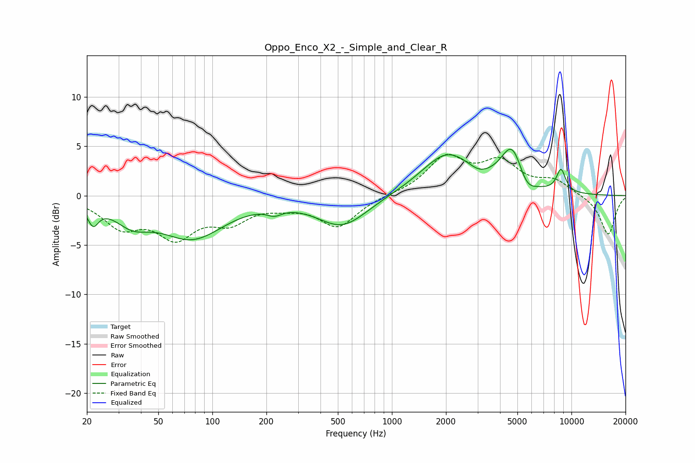

# Oppo_Enco_X2_-_Simple_and_Clear_R
See [usage instructions](https://github.com/jaakkopasanen/AutoEq#usage) for more options and info.

### Parametric EQs
Apply preamp of -4.8 dB when using parametric equalizer.

|   # | Type    |   Fc (Hz) |    Q |   Gain (dB) |
|-----|---------|-----------|------|-------------|
|   1 | Peaking |        22 | 4.71 |        -2   |
|   2 | Peaking |        36 | 1.44 |        -2   |
|   3 | Peaking |        77 | 0.79 |        -4.1 |
|   4 | Peaking |       222 | 3.38 |        -0.7 |
|   5 | Peaking |       530 | 1.01 |        -3.1 |
|   6 | Peaking |      2035 | 0.98 |         4.2 |
|   7 | Peaking |      3048 | 2.77 |        -0.5 |
|   8 | Peaking |      4685 | 2.2  |         4.5 |
|   9 | Peaking |      5596 | 2.79 |        -1.6 |
|  10 | Peaking |      8747 | 5.03 |         2.3 |

### Fixed Band EQs
When using fixed band (also called graphic) equalizer, apply preamp of **-4.3 dB** (if available) and set gains manually with these parameters.

|   # | Type    |   Fc (Hz) |    Q |   Gain (dB) |
|-----|---------|-----------|------|-------------|
|   1 | Peaking |        31 | 1.41 |        -2.9 |
|   2 | Peaking |        62 | 1.41 |        -3.7 |
|   3 | Peaking |       125 | 1.41 |        -2.2 |
|   4 | Peaking |       250 | 1.41 |        -0.7 |
|   5 | Peaking |       500 | 1.41 |        -3.1 |
|   6 | Peaking |      1000 | 1.41 |         0.1 |
|   7 | Peaking |      2000 | 1.41 |         3.7 |
|   8 | Peaking |      4000 | 1.41 |         3.1 |
|   9 | Peaking |      8000 | 1.41 |         1.4 |
|  10 | Peaking |     16000 | 1.41 |        -4   |

### Graphs

