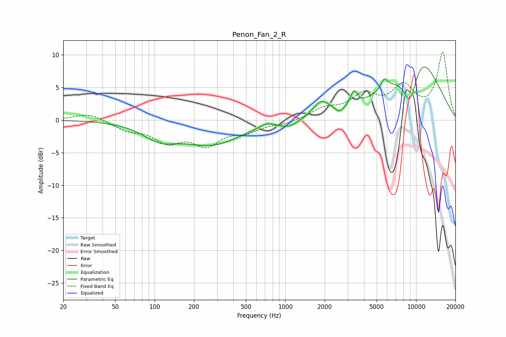

# Penon_Fan_2_R
See [usage instructions](https://github.com/jaakkopasanen/AutoEq#usage) for more options and info.

### Parametric EQs
Apply preamp of -8.2 dB when using parametric equalizer.

|   # | Type    |   Fc (Hz) |    Q |   Gain (dB) |
|-----|---------|-----------|------|-------------|
|   1 | Peaking |       110 | 1.07 |        -2.3 |
|   2 | Peaking |       277 | 0.64 |        -3.5 |
|   3 | Peaking |       719 | 2.66 |         0.7 |
|   4 | Peaking |      1072 | 1.96 |        -1   |
|   5 | Peaking |      1883 | 2.23 |         2.4 |
|   6 | Peaking |      2591 | 5.2  |        -0.8 |
|   7 | Peaking |      3342 | 6    |         2.2 |
|   8 | Peaking |      5729 | 5.71 |         1.6 |
|   9 | Peaking |      9001 | 2.01 |        -7.8 |
|  10 | Peaking |     10000 | 0.65 |        11.7 |

### Fixed Band EQs
When using fixed band (also called graphic) equalizer, apply preamp of **-10.5 dB** (if available) and set gains manually with these parameters.

|   # | Type    |   Fc (Hz) |    Q |   Gain (dB) |
|-----|---------|-----------|------|-------------|
|   1 | Peaking |        31 | 1.41 |         1.1 |
|   2 | Peaking |        62 | 1.41 |        -1.4 |
|   3 | Peaking |       125 | 1.41 |        -3   |
|   4 | Peaking |       250 | 1.41 |        -3.4 |
|   5 | Peaking |       500 | 1.41 |        -1.5 |
|   6 | Peaking |      1000 | 1.41 |        -0.6 |
|   7 | Peaking |      2000 | 1.41 |         1.5 |
|   8 | Peaking |      4000 | 1.41 |         3.4 |
|   9 | Peaking |      8000 | 1.41 |         4.6 |
|  10 | Peaking |     16000 | 1.41 |        10.2 |

### Graphs

