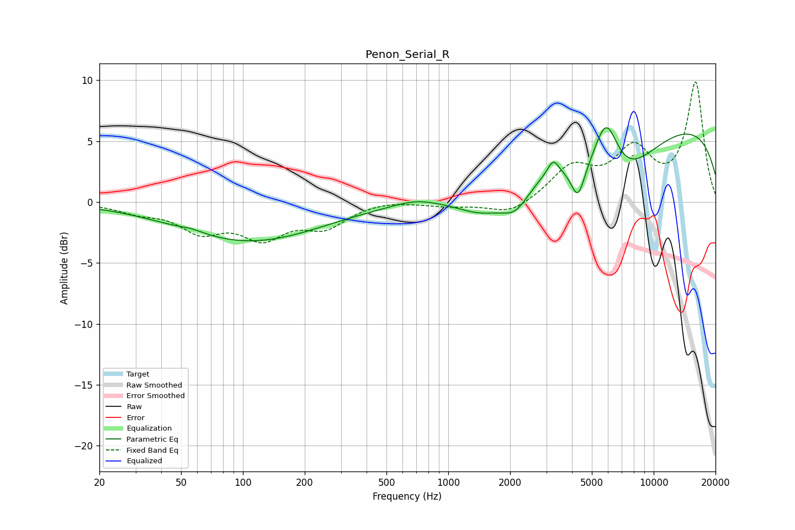

# Penon_Serial_R
See [usage instructions](https://github.com/jaakkopasanen/AutoEq#usage) for more options and info.

### Parametric EQs
Apply preamp of -6.2 dB when using parametric equalizer.

|   # | Type    |   Fc (Hz) |    Q |   Gain (dB) |
|-----|---------|-----------|------|-------------|
|   1 | Peaking |        56 | 2.38 |         0.2 |
|   2 | Peaking |       107 | 0.4  |        -3.2 |
|   3 | Peaking |       694 | 1.34 |         0.5 |
|   4 | Peaking |      1503 | 1    |        -2.2 |
|   5 | Peaking |      2128 | 2.08 |        -1.9 |
|   6 | Peaking |      3242 | 5.02 |         1.3 |
|   7 | Peaking |      4278 | 4.27 |        -2.7 |
|   8 | Peaking |      5866 | 2.23 |         5.2 |
|   9 | Peaking |      6459 | 0.73 |        -5.2 |
|  10 | Peaking |      9810 | 0.19 |         6.9 |

### Fixed Band EQs
When using fixed band (also called graphic) equalizer, apply preamp of **-9.9 dB** (if available) and set gains manually with these parameters.

|   # | Type    |   Fc (Hz) |    Q |   Gain (dB) |
|-----|---------|-----------|------|-------------|
|   1 | Peaking |        31 | 1.41 |        -0.7 |
|   2 | Peaking |        62 | 1.41 |        -2.1 |
|   3 | Peaking |       125 | 1.41 |        -2.6 |
|   4 | Peaking |       250 | 1.41 |        -1.8 |
|   5 | Peaking |       500 | 1.41 |         0.2 |
|   6 | Peaking |      1000 | 1.41 |        -0.3 |
|   7 | Peaking |      2000 | 1.41 |        -1.1 |
|   8 | Peaking |      4000 | 1.41 |         2.7 |
|   9 | Peaking |      8000 | 1.41 |         4   |
|  10 | Peaking |     16000 | 1.41 |         9.7 |

### Graphs

