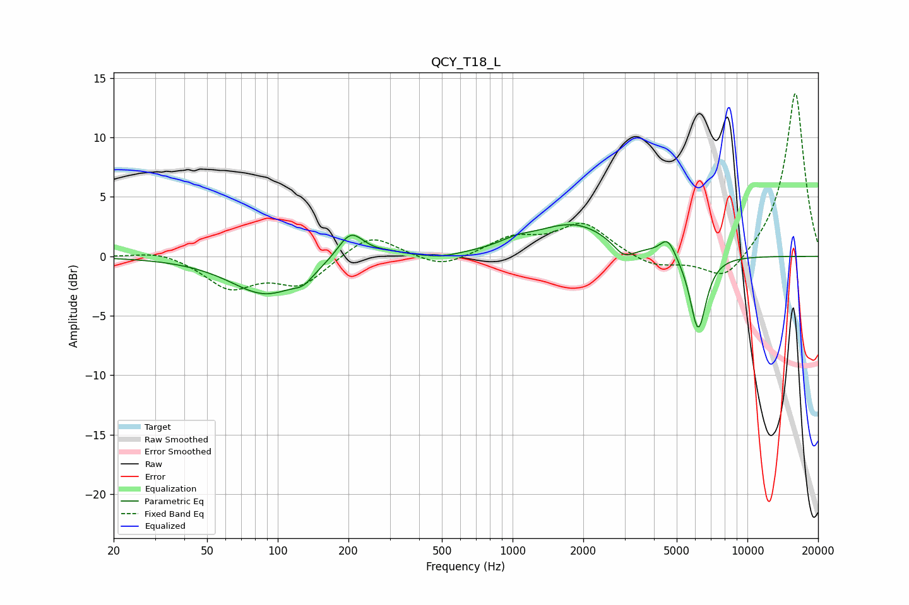

# QCY_T18_L
See [usage instructions](https://github.com/jaakkopasanen/AutoEq#usage) for more options and info.

### Parametric EQs
Apply preamp of -2.8 dB when using parametric equalizer.

|   # | Type    |   Fc (Hz) |    Q |   Gain (dB) |
|-----|---------|-----------|------|-------------|
|   1 | Peaking |        89 | 0.94 |        -3.2 |
|   2 | Peaking |       129 | 3.56 |        -0.7 |
|   3 | Peaking |       204 | 2.47 |         2.5 |
|   4 | Peaking |       295 | 2.16 |         0.3 |
|   5 | Peaking |       500 | 1.98 |        -0.3 |
|   6 | Peaking |      1036 | 2.08 |         0.5 |
|   7 | Peaking |      1825 | 0.84 |         2.7 |
|   8 | Peaking |      2982 | 2.98 |        -1.3 |
|   9 | Peaking |      4582 | 4.24 |         1.6 |
|  10 | Peaking |      6170 | 3.94 |        -6.4 |

### Fixed Band EQs
When using fixed band (also called graphic) equalizer, apply preamp of **-13.8 dB** (if available) and set gains manually with these parameters.

|   # | Type    |   Fc (Hz) |    Q |   Gain (dB) |
|-----|---------|-----------|------|-------------|
|   1 | Peaking |        31 | 1.41 |         0.6 |
|   2 | Peaking |        62 | 1.41 |        -2.5 |
|   3 | Peaking |       125 | 1.41 |        -2.3 |
|   4 | Peaking |       250 | 1.41 |         2   |
|   5 | Peaking |       500 | 1.41 |        -1.1 |
|   6 | Peaking |      1000 | 1.41 |         1.5 |
|   7 | Peaking |      2000 | 1.41 |         2.7 |
|   8 | Peaking |      4000 | 1.41 |        -1   |
|   9 | Peaking |      8000 | 1.41 |        -2.3 |
|  10 | Peaking |     16000 | 1.41 |        13.9 |

### Graphs

