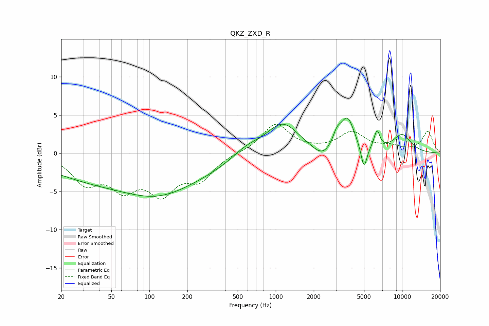

# QKZ_ZXD_R
See [usage instructions](https://github.com/jaakkopasanen/AutoEq#usage) for more options and info.

### Parametric EQs
Apply preamp of -4.7 dB when using parametric equalizer.

|   # | Type    |   Fc (Hz) |    Q |   Gain (dB) |
|-----|---------|-----------|------|-------------|
|   1 | Peaking |        77 | 0.2  |        -4.2 |
|   2 | Peaking |       116 | 0.63 |        -1.5 |
|   3 | Peaking |       586 | 1.22 |         1.3 |
|   4 | Peaking |      1134 | 1.09 |         4   |
|   5 | Peaking |      2353 | 1.85 |        -1.5 |
|   6 | Peaking |      3043 | 4.22 |         1.6 |
|   7 | Peaking |      3692 | 2.52 |         4.3 |
|   8 | Peaking |      4994 | 5.78 |        -3.2 |
|   9 | Peaking |      6330 | 6    |         2.3 |
|  10 | Peaking |     10000 | 1.64 |         2.3 |

### Fixed Band EQs
When using fixed band (also called graphic) equalizer, apply preamp of **-3.9 dB** (if available) and set gains manually with these parameters.

|   # | Type    |   Fc (Hz) |    Q |   Gain (dB) |
|-----|---------|-----------|------|-------------|
|   1 | Peaking |        31 | 1.41 |        -3.6 |
|   2 | Peaking |        62 | 1.41 |        -3.9 |
|   3 | Peaking |       125 | 1.41 |        -4.6 |
|   4 | Peaking |       250 | 1.41 |        -3.1 |
|   5 | Peaking |       500 | 1.41 |         0.1 |
|   6 | Peaking |      1000 | 1.41 |         3.8 |
|   7 | Peaking |      2000 | 1.41 |         0.2 |
|   8 | Peaking |      4000 | 1.41 |         2.6 |
|   9 | Peaking |      8000 | 1.41 |         0.7 |
|  10 | Peaking |     16000 | 1.41 |         2.8 |

### Graphs

