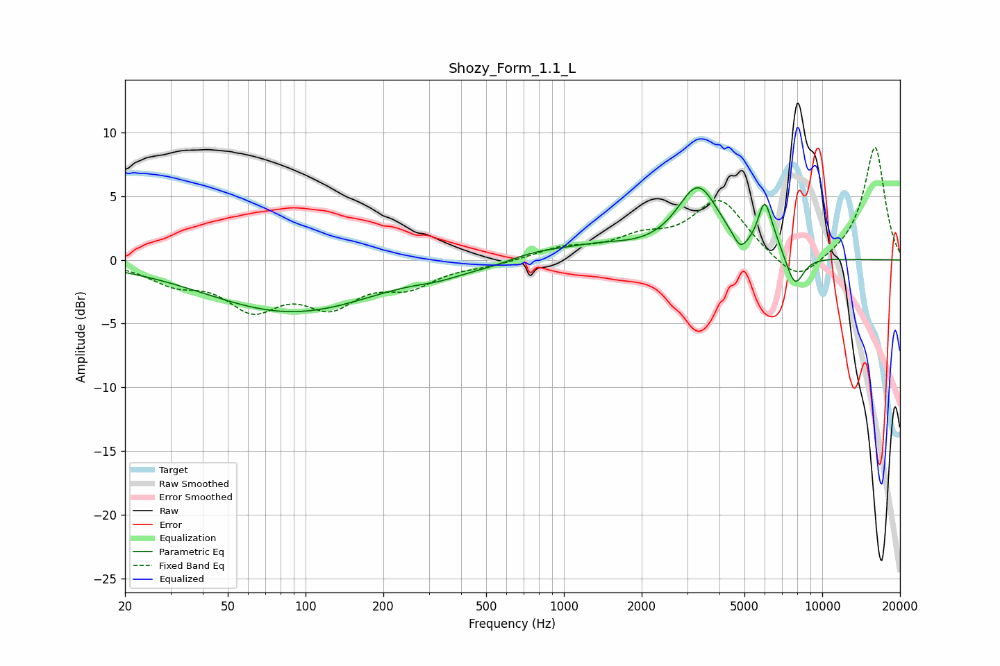

# Shozy_Form_1.1_L
See [usage instructions](https://github.com/jaakkopasanen/AutoEq#usage) for more options and info.

### Parametric EQs
Apply preamp of -5.8 dB when using parametric equalizer.

|   # | Type    |   Fc (Hz) |    Q |   Gain (dB) |
|-----|---------|-----------|------|-------------|
|   1 | Peaking |        88 | 0.42 |        -4.1 |
|   2 | Peaking |       328 | 1.71 |        -0.4 |
|   3 | Peaking |       561 | 1.02 |        -0.8 |
|   4 | Peaking |       705 | 0.93 |         1.1 |
|   5 | Peaking |      1385 | 1.03 |         0.8 |
|   6 | Peaking |      3309 | 1.71 |         5.5 |
|   7 | Peaking |      4816 | 5.12 |        -1.2 |
|   8 | Peaking |      5970 | 5.52 |         3.2 |
|   9 | Peaking |      6424 | 3.67 |         1   |
|  10 | Peaking |      7842 | 3.85 |        -2.5 |

### Fixed Band EQs
When using fixed band (also called graphic) equalizer, apply preamp of **-8.9 dB** (if available) and set gains manually with these parameters.

|   # | Type    |   Fc (Hz) |    Q |   Gain (dB) |
|-----|---------|-----------|------|-------------|
|   1 | Peaking |        31 | 1.41 |        -1.5 |
|   2 | Peaking |        62 | 1.41 |        -3.4 |
|   3 | Peaking |       125 | 1.41 |        -3.1 |
|   4 | Peaking |       250 | 1.41 |        -1.8 |
|   5 | Peaking |       500 | 1.41 |        -0.3 |
|   6 | Peaking |      1000 | 1.41 |         0.9 |
|   7 | Peaking |      2000 | 1.41 |         1.4 |
|   8 | Peaking |      4000 | 1.41 |         4.6 |
|   9 | Peaking |      8000 | 1.41 |        -2.1 |
|  10 | Peaking |     16000 | 1.41 |         8.9 |

### Graphs

