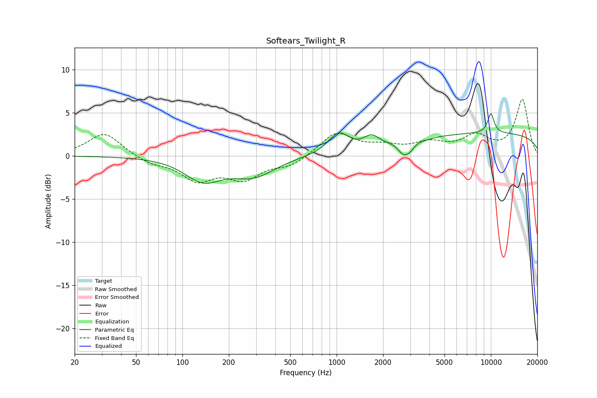

# Softears_Twilight_R
See [usage instructions](https://github.com/jaakkopasanen/AutoEq#usage) for more options and info.

### Parametric EQs
Apply preamp of -5.0 dB when using parametric equalizer.

|   # | Type    |   Fc (Hz) |    Q |   Gain (dB) |
|-----|---------|-----------|------|-------------|
|   1 | Peaking |       136 | 1.19 |        -2.6 |
|   2 | Peaking |       290 | 1.03 |        -2.1 |
|   3 | Peaking |      1027 | 2.18 |         2.3 |
|   4 | Peaking |      1684 | 2.92 |         1.2 |
|   5 | Peaking |      2684 | 4.45 |        -1.1 |
|   6 | Peaking |      2967 | 4.5  |        -0.9 |
|   7 | Peaking |      3890 | 5.01 |        -0.1 |
|   8 | Peaking |     10000 | 5.86 |         2.2 |
|   9 | Peaking |     10000 | 0.18 |         2.6 |
|  10 | Peaking |     10000 | 3.07 |         0.1 |

### Fixed Band EQs
When using fixed band (also called graphic) equalizer, apply preamp of **-6.6 dB** (if available) and set gains manually with these parameters.

|   # | Type    |   Fc (Hz) |    Q |   Gain (dB) |
|-----|---------|-----------|------|-------------|
|   1 | Peaking |        31 | 1.41 |         2.7 |
|   2 | Peaking |        62 | 1.41 |        -0.8 |
|   3 | Peaking |       125 | 1.41 |        -2.6 |
|   4 | Peaking |       250 | 1.41 |        -2.4 |
|   5 | Peaking |       500 | 1.41 |        -1.1 |
|   6 | Peaking |      1000 | 1.41 |         2.7 |
|   7 | Peaking |      2000 | 1.41 |         0.9 |
|   8 | Peaking |      4000 | 1.41 |         1.3 |
|   9 | Peaking |      8000 | 1.41 |         2.1 |
|  10 | Peaking |     16000 | 1.41 |         6.5 |

### Graphs

