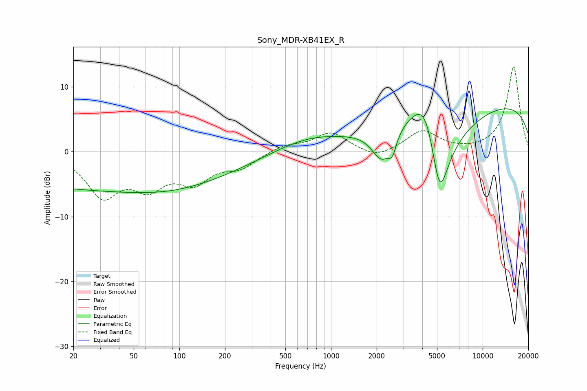

# Sony_MDR-XB41EX_R
See [usage instructions](https://github.com/jaakkopasanen/AutoEq#usage) for more options and info.

### Parametric EQs
Apply preamp of -6.7 dB when using parametric equalizer.

|   # | Type    |   Fc (Hz) |    Q |   Gain (dB) |
|-----|---------|-----------|------|-------------|
|   1 | Peaking |        21 | 0.22 |        -5.3 |
|   2 | Peaking |        84 | 1.65 |        -0.1 |
|   3 | Peaking |       131 | 0.4  |        -3.4 |
|   4 | Peaking |       696 | 0.66 |         1.6 |
|   5 | Peaking |      1171 | 0.32 |         0.5 |
|   6 | Peaking |      2157 | 2.13 |        -4.9 |
|   7 | Peaking |      2540 | 5.59 |        -2.4 |
|   8 | Peaking |      4238 | 1.24 |        11.3 |
|   9 | Peaking |      5191 | 1.4  |       -20   |
|  10 | Peaking |     10000 | 0.18 |         8   |

### Fixed Band EQs
When using fixed band (also called graphic) equalizer, apply preamp of **-13.2 dB** (if available) and set gains manually with these parameters.

|   # | Type    |   Fc (Hz) |    Q |   Gain (dB) |
|-----|---------|-----------|------|-------------|
|   1 | Peaking |        31 | 1.41 |        -6.4 |
|   2 | Peaking |        62 | 1.41 |        -4.6 |
|   3 | Peaking |       125 | 1.41 |        -4.1 |
|   4 | Peaking |       250 | 1.41 |        -2.2 |
|   5 | Peaking |       500 | 1.41 |         1   |
|   6 | Peaking |      1000 | 1.41 |         2.9 |
|   7 | Peaking |      2000 | 1.41 |        -1.2 |
|   8 | Peaking |      4000 | 1.41 |         3.2 |
|   9 | Peaking |      8000 | 1.41 |        -0.1 |
|  10 | Peaking |     16000 | 1.41 |        13.2 |

### Graphs

