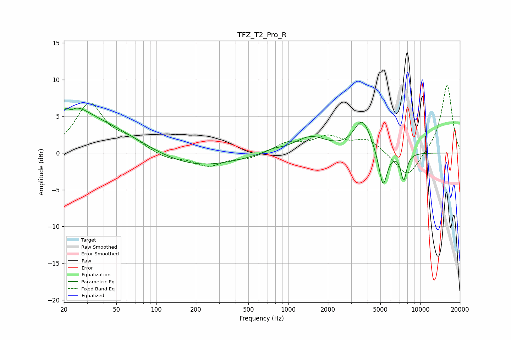

# TFZ_T2_Pro_R
See [usage instructions](https://github.com/jaakkopasanen/AutoEq#usage) for more options and info.

### Parametric EQs
Apply preamp of -6.2 dB when using parametric equalizer.

|   # | Type    |   Fc (Hz) |    Q |   Gain (dB) |
|-----|---------|-----------|------|-------------|
|   1 | Peaking |        22 | 5.94 |         3.2 |
|   2 | Peaking |        22 | 5.97 |        -3.4 |
|   3 | Peaking |        24 | 1.41 |         1.5 |
|   4 | Peaking |        24 | 0.34 |         4.9 |
|   5 | Peaking |       189 | 0.45 |        -2.1 |
|   6 | Peaking |       760 | 2.11 |         0.5 |
|   7 | Peaking |      1475 | 1.15 |         2.2 |
|   8 | Peaking |      3648 | 2.2  |         4.3 |
|   9 | Peaking |      5229 | 4.35 |        -5.2 |
|  10 | Peaking |      7508 | 6    |        -3.7 |

### Fixed Band EQs
When using fixed band (also called graphic) equalizer, apply preamp of **-9.3 dB** (if available) and set gains manually with these parameters.

|   # | Type    |   Fc (Hz) |    Q |   Gain (dB) |
|-----|---------|-----------|------|-------------|
|   1 | Peaking |        31 | 1.41 |         6.6 |
|   2 | Peaking |        62 | 1.41 |         1.4 |
|   3 | Peaking |       125 | 1.41 |        -0.8 |
|   4 | Peaking |       250 | 1.41 |        -1.7 |
|   5 | Peaking |       500 | 1.41 |        -0.7 |
|   6 | Peaking |      1000 | 1.41 |         1.3 |
|   7 | Peaking |      2000 | 1.41 |         2   |
|   8 | Peaking |      4000 | 1.41 |         1.8 |
|   9 | Peaking |      8000 | 1.41 |        -3.6 |
|  10 | Peaking |     16000 | 1.41 |         9.4 |

### Graphs

