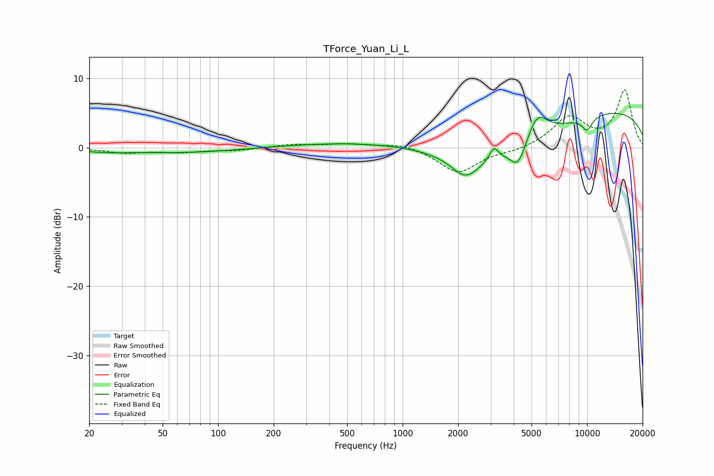

# TForce_Yuan_Li_L
See [usage instructions](https://github.com/jaakkopasanen/AutoEq#usage) for more options and info.

### Parametric EQs
Apply preamp of -5.1 dB when using parametric equalizer.

|   # | Type    |   Fc (Hz) |    Q |   Gain (dB) |
|-----|---------|-----------|------|-------------|
|   1 | Peaking |        24 | 1.31 |        -0.4 |
|   2 | Peaking |        62 | 0.45 |        -0.7 |
|   3 | Peaking |       668 | 0.33 |         0.9 |
|   4 | Peaking |      2187 | 1.9  |        -3   |
|   5 | Peaking |      3129 | 5.75 |         2   |
|   6 | Peaking |      3390 | 0.48 |        -5.3 |
|   7 | Peaking |      4234 | 3.48 |        -3.2 |
|   8 | Peaking |      5362 | 2.41 |         3.9 |
|   9 | Peaking |     10000 | 4.27 |        -1.9 |
|  10 | Peaking |     10000 | 0.19 |         5.9 |

### Fixed Band EQs
When using fixed band (also called graphic) equalizer, apply preamp of **-8.4 dB** (if available) and set gains manually with these parameters.

|   # | Type    |   Fc (Hz) |    Q |   Gain (dB) |
|-----|---------|-----------|------|-------------|
|   1 | Peaking |        31 | 1.41 |        -0.7 |
|   2 | Peaking |        62 | 1.41 |        -0.6 |
|   3 | Peaking |       125 | 1.41 |        -0.4 |
|   4 | Peaking |       250 | 1.41 |         0.5 |
|   5 | Peaking |       500 | 1.41 |         0.5 |
|   6 | Peaking |      1000 | 1.41 |         0.7 |
|   7 | Peaking |      2000 | 1.41 |        -3.6 |
|   8 | Peaking |      4000 | 1.41 |        -0.5 |
|   9 | Peaking |      8000 | 1.41 |         4.3 |
|  10 | Peaking |     16000 | 1.41 |         8.2 |

### Graphs

