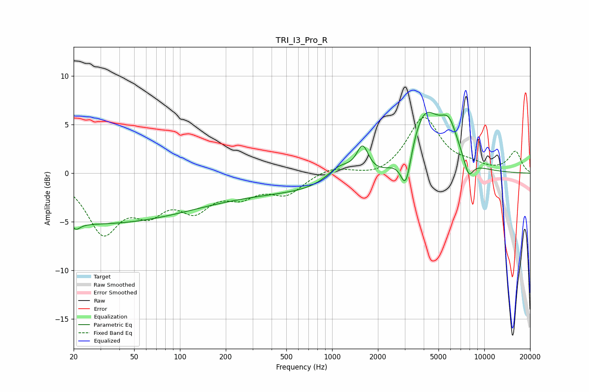

# TRI_I3_Pro_R
See [usage instructions](https://github.com/jaakkopasanen/AutoEq#usage) for more options and info.

### Parametric EQs
Apply preamp of -6.4 dB when using parametric equalizer.

|   # | Type    |   Fc (Hz) |    Q |   Gain (dB) |
|-----|---------|-----------|------|-------------|
|   1 | Peaking |        20 | 5.06 |         3.7 |
|   2 | Peaking |        20 | 5.01 |        -4.3 |
|   3 | Peaking |        25 | 0.2  |        -5.1 |
|   4 | Peaking |       641 | 0.18 |        -2   |
|   5 | Peaking |      1127 | 1.56 |         2   |
|   6 | Peaking |      1586 | 3.49 |         3   |
|   7 | Peaking |      3054 | 3.99 |        -4.1 |
|   8 | Peaking |      4024 | 1.33 |         6.7 |
|   9 | Peaking |      5862 | 2.27 |         3.5 |
|  10 | Peaking |      7892 | 4.36 |        -1.9 |

### Fixed Band EQs
When using fixed band (also called graphic) equalizer, apply preamp of **-5.8 dB** (if available) and set gains manually with these parameters.

|   # | Type    |   Fc (Hz) |    Q |   Gain (dB) |
|-----|---------|-----------|------|-------------|
|   1 | Peaking |        31 | 1.41 |        -5.8 |
|   2 | Peaking |        62 | 1.41 |        -3.1 |
|   3 | Peaking |       125 | 1.41 |        -3.2 |
|   4 | Peaking |       250 | 1.41 |        -1.9 |
|   5 | Peaking |       500 | 1.41 |        -2   |
|   6 | Peaking |      1000 | 1.41 |         0.7 |
|   7 | Peaking |      2000 | 1.41 |        -0.5 |
|   8 | Peaking |      4000 | 1.41 |         5.7 |
|   9 | Peaking |      8000 | 1.41 |         0.6 |
|  10 | Peaking |     16000 | 1.41 |         2.2 |

### Graphs

