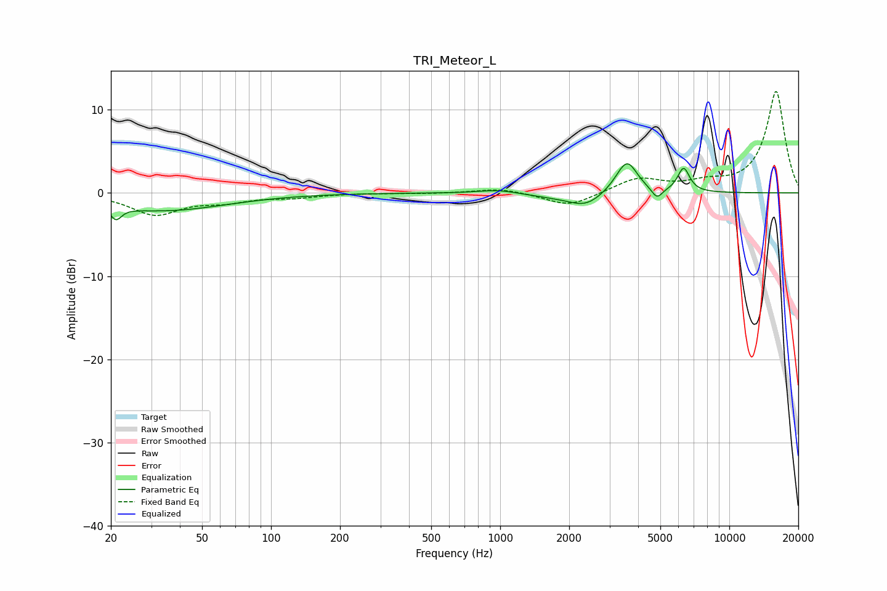

# TRI_Meteor_L
See [usage instructions](https://github.com/jaakkopasanen/AutoEq#usage) for more options and info.

### Parametric EQs
Apply preamp of -3.6 dB when using parametric equalizer.

|   # | Type    |   Fc (Hz) |    Q |   Gain (dB) |
|-----|---------|-----------|------|-------------|
|   1 | Peaking |        21 | 6    |         1.2 |
|   2 | Peaking |        21 | 5.99 |        -2.7 |
|   3 | Peaking |        34 | 0.51 |        -2.1 |
|   4 | Peaking |       973 | 1.69 |         0.4 |
|   5 | Peaking |      1697 | 1.27 |        -0.4 |
|   6 | Peaking |      2361 | 1.88 |        -1.6 |
|   7 | Peaking |      3394 | 2.52 |         0.9 |
|   8 | Peaking |      3597 | 3.23 |         3.2 |
|   9 | Peaking |      4834 | 6    |        -1.3 |
|  10 | Peaking |      6319 | 5.24 |         2.9 |

### Fixed Band EQs
When using fixed band (also called graphic) equalizer, apply preamp of **-12.3 dB** (if available) and set gains manually with these parameters.

|   # | Type    |   Fc (Hz) |    Q |   Gain (dB) |
|-----|---------|-----------|------|-------------|
|   1 | Peaking |        31 | 1.41 |        -2.5 |
|   2 | Peaking |        62 | 1.41 |        -0.9 |
|   3 | Peaking |       125 | 1.41 |        -0.5 |
|   4 | Peaking |       250 | 1.41 |        -0   |
|   5 | Peaking |       500 | 1.41 |        -0.1 |
|   6 | Peaking |      1000 | 1.41 |         0.6 |
|   7 | Peaking |      2000 | 1.41 |        -1.7 |
|   8 | Peaking |      4000 | 1.41 |         1.7 |
|   9 | Peaking |      8000 | 1.41 |         0.9 |
|  10 | Peaking |     16000 | 1.41 |        12.2 |

### Graphs

