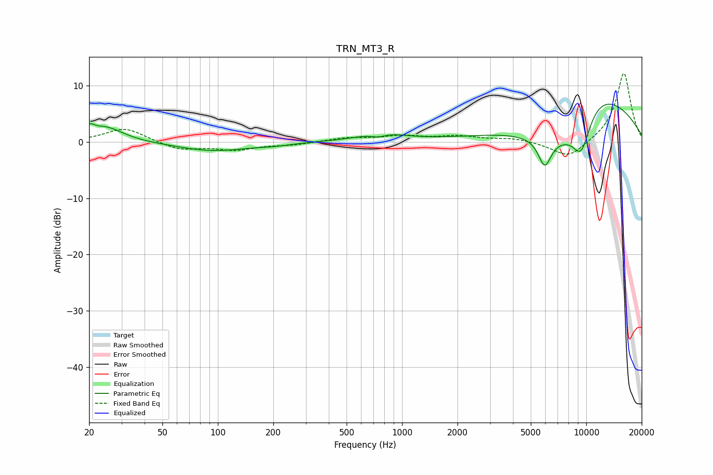

# TRN_MT3_R
See [usage instructions](https://github.com/jaakkopasanen/AutoEq#usage) for more options and info.

### Parametric EQs
Apply preamp of -6.8 dB when using parametric equalizer.

|   # | Type    |   Fc (Hz) |    Q |   Gain (dB) |
|-----|---------|-----------|------|-------------|
|   1 | Peaking |        20 | 5.4  |         1.4 |
|   2 | Peaking |        24 | 1.46 |         2.7 |
|   3 | Peaking |        94 | 0.74 |        -1.6 |
|   4 | Peaking |       203 | 1.83 |        -0.3 |
|   5 | Peaking |       745 | 3.05 |        -0.8 |
|   6 | Peaking |       764 | 1.2  |         1.6 |
|   7 | Peaking |      5951 | 3.94 |        -4.9 |
|   8 | Peaking |      7544 | 0.64 |        -9.5 |
|   9 | Peaking |      9399 | 2.31 |        -7.4 |
|  10 | Peaking |     10000 | 0.45 |        14.5 |

### Fixed Band EQs
When using fixed band (also called graphic) equalizer, apply preamp of **-12.3 dB** (if available) and set gains manually with these parameters.

|   # | Type    |   Fc (Hz) |    Q |   Gain (dB) |
|-----|---------|-----------|------|-------------|
|   1 | Peaking |        31 | 1.41 |         2.5 |
|   2 | Peaking |        62 | 1.41 |        -1.4 |
|   3 | Peaking |       125 | 1.41 |        -1.3 |
|   4 | Peaking |       250 | 1.41 |        -0.5 |
|   5 | Peaking |       500 | 1.41 |         0.7 |
|   6 | Peaking |      1000 | 1.41 |         1   |
|   7 | Peaking |      2000 | 1.41 |         0.9 |
|   8 | Peaking |      4000 | 1.41 |         0.6 |
|   9 | Peaking |      8000 | 1.41 |        -3   |
|  10 | Peaking |     16000 | 1.41 |        12.4 |

### Graphs

