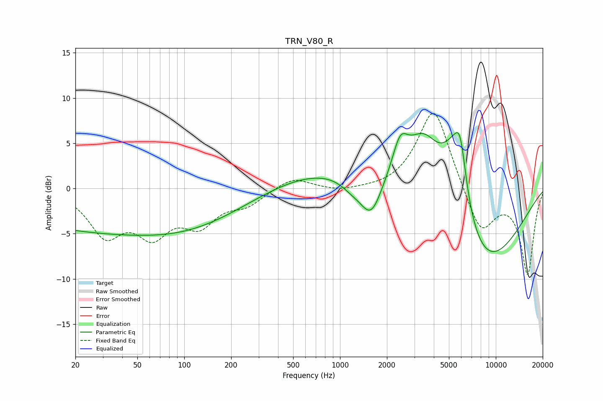

# TRN_V80_R
See [usage instructions](https://github.com/jaakkopasanen/AutoEq#usage) for more options and info.

### Parametric EQs
Apply preamp of -6.3 dB when using parametric equalizer.

|   # | Type    |   Fc (Hz) |    Q |   Gain (dB) |
|-----|---------|-----------|------|-------------|
|   1 | Peaking |        30 | 0.21 |        -4.6 |
|   2 | Peaking |       161 | 0.4  |        -2   |
|   3 | Peaking |       856 | 0.33 |         2.4 |
|   4 | Peaking |      1192 | 1.83 |        -1.1 |
|   5 | Peaking |      1585 | 1.98 |        -4.5 |
|   6 | Peaking |      2434 | 2.84 |         3.6 |
|   7 | Peaking |      3446 | 1.18 |         7.2 |
|   8 | Peaking |      5335 | 1.56 |         7.2 |
|   9 | Peaking |      5912 | 3.6  |         5.3 |
|  10 | Peaking |      7825 | 0.49 |        -9.8 |

### Fixed Band EQs
When using fixed band (also called graphic) equalizer, apply preamp of **-8.4 dB** (if available) and set gains manually with these parameters.

|   # | Type    |   Fc (Hz) |    Q |   Gain (dB) |
|-----|---------|-----------|------|-------------|
|   1 | Peaking |        31 | 1.41 |        -4.8 |
|   2 | Peaking |        62 | 1.41 |        -4.4 |
|   3 | Peaking |       125 | 1.41 |        -3.5 |
|   4 | Peaking |       250 | 1.41 |        -1.6 |
|   5 | Peaking |       500 | 1.41 |         1.3 |
|   6 | Peaking |      1000 | 1.41 |        -0.4 |
|   7 | Peaking |      2000 | 1.41 |        -0.2 |
|   8 | Peaking |      4000 | 1.41 |         9.2 |
|   9 | Peaking |      8000 | 1.41 |        -5.1 |
|  10 | Peaking |     16000 | 1.41 |        -9.4 |

### Graphs

