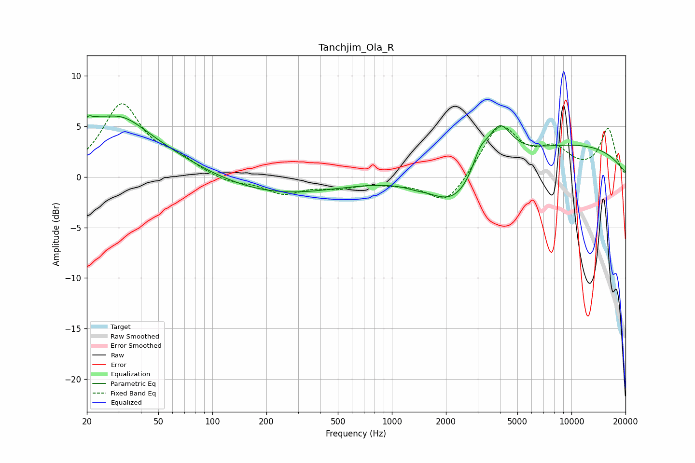

# Tanchjim_Ola_R
See [usage instructions](https://github.com/jaakkopasanen/AutoEq#usage) for more options and info.

### Parametric EQs
Apply preamp of -6.2 dB when using parametric equalizer.

|   # | Type    |   Fc (Hz) |    Q |   Gain (dB) |
|-----|---------|-----------|------|-------------|
|   1 | Peaking |        21 | 5.32 |         3.6 |
|   2 | Peaking |        22 | 5.95 |        -3   |
|   3 | Peaking |        25 | 0.41 |         5   |
|   4 | Peaking |        32 | 1.28 |         1.2 |
|   5 | Peaking |       227 | 0.43 |        -1.8 |
|   6 | Peaking |      1330 | 3.22 |        -0.2 |
|   7 | Peaking |      2239 | 1.02 |        -3.3 |
|   8 | Peaking |      3101 | 3.22 |         2   |
|   9 | Peaking |      3972 | 2.06 |         3.9 |
|  10 | Peaking |     10000 | 0.31 |         3.1 |

### Fixed Band EQs
When using fixed band (also called graphic) equalizer, apply preamp of **-7.3 dB** (if available) and set gains manually with these parameters.

|   # | Type    |   Fc (Hz) |    Q |   Gain (dB) |
|-----|---------|-----------|------|-------------|
|   1 | Peaking |        31 | 1.41 |         7   |
|   2 | Peaking |        62 | 1.41 |         1.5 |
|   3 | Peaking |       125 | 1.41 |        -0.6 |
|   4 | Peaking |       250 | 1.41 |        -1.5 |
|   5 | Peaking |       500 | 1.41 |        -0.9 |
|   6 | Peaking |      1000 | 1.41 |        -0.4 |
|   7 | Peaking |      2000 | 1.41 |        -2.9 |
|   8 | Peaking |      4000 | 1.41 |         5.1 |
|   9 | Peaking |      8000 | 1.41 |         2.3 |
|  10 | Peaking |     16000 | 1.41 |         4.7 |

### Graphs

