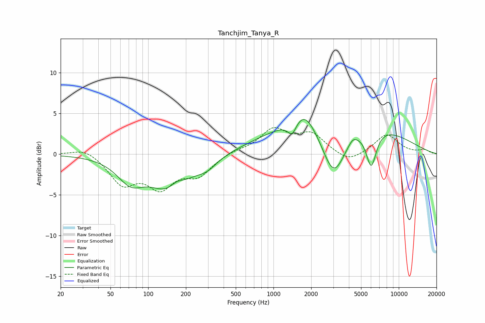

# Tanchjim_Tanya_R
See [usage instructions](https://github.com/jaakkopasanen/AutoEq#usage) for more options and info.

### Parametric EQs
Apply preamp of -4.4 dB when using parametric equalizer.

|   # | Type    |   Fc (Hz) |    Q |   Gain (dB) |
|-----|---------|-----------|------|-------------|
|   1 | Peaking |        72 | 1.32 |        -2.8 |
|   2 | Peaking |       153 | 0.93 |        -4.6 |
|   3 | Peaking |       168 | 2.23 |         1.4 |
|   4 | Peaking |       295 | 1.79 |        -1.1 |
|   5 | Peaking |      1408 | 4.05 |        -1.7 |
|   6 | Peaking |      1767 | 1.78 |         2   |
|   7 | Peaking |      3028 | 1.39 |        -7.3 |
|   8 | Peaking |      3120 | 0.28 |         5.4 |
|   9 | Peaking |      4287 | 4.45 |         0.6 |
|  10 | Peaking |      6025 | 3.3  |        -4.7 |

### Fixed Band EQs
When using fixed band (also called graphic) equalizer, apply preamp of **-3.4 dB** (if available) and set gains manually with these parameters.

|   # | Type    |   Fc (Hz) |    Q |   Gain (dB) |
|-----|---------|-----------|------|-------------|
|   1 | Peaking |        31 | 1.41 |         0.9 |
|   2 | Peaking |        62 | 1.41 |        -3.4 |
|   3 | Peaking |       125 | 1.41 |        -3.6 |
|   4 | Peaking |       250 | 1.41 |        -2.4 |
|   5 | Peaking |       500 | 1.41 |         0.4 |
|   6 | Peaking |      1000 | 1.41 |         2.9 |
|   7 | Peaking |      2000 | 1.41 |         2.3 |
|   8 | Peaking |      4000 | 1.41 |        -1.2 |
|   9 | Peaking |      8000 | 1.41 |         2.4 |
|  10 | Peaking |     16000 | 1.41 |         0.5 |

### Graphs

