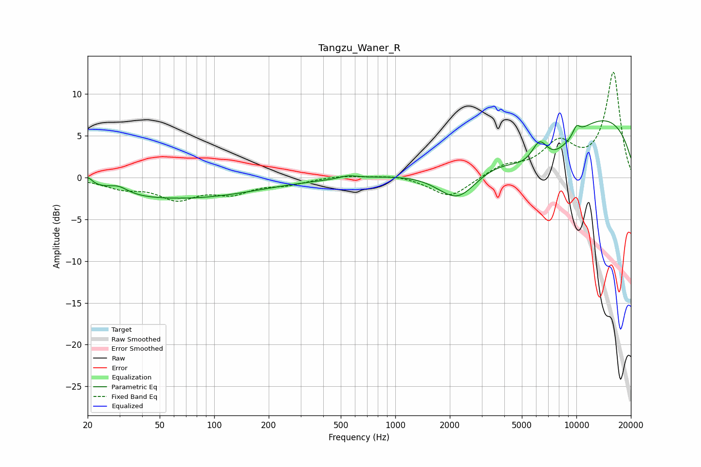

# Tangzu_Waner_R
See [usage instructions](https://github.com/jaakkopasanen/AutoEq#usage) for more options and info.

### Parametric EQs
Apply preamp of -6.9 dB when using parametric equalizer.

|   # | Type    |   Fc (Hz) |    Q |   Gain (dB) |
|-----|---------|-----------|------|-------------|
|   1 | Peaking |        20 | 5.73 |         0.9 |
|   2 | Peaking |        30 | 2.81 |         0.7 |
|   3 | Peaking |        37 | 0.94 |        -0.5 |
|   4 | Peaking |        74 | 0.38 |        -2.3 |
|   5 | Peaking |       550 | 2.9  |         0.4 |
|   6 | Peaking |      2219 | 1.19 |        -4.7 |
|   7 | Peaking |      6264 | 2.79 |         3.5 |
|   8 | Peaking |      6440 | 0.75 |        -6.8 |
|   9 | Peaking |     10000 | 6    |         1.1 |
|  10 | Peaking |     10000 | 0.22 |         8.8 |

### Fixed Band EQs
When using fixed band (also called graphic) equalizer, apply preamp of **-12.7 dB** (if available) and set gains manually with these parameters.

|   # | Type    |   Fc (Hz) |    Q |   Gain (dB) |
|-----|---------|-----------|------|-------------|
|   1 | Peaking |        31 | 1.41 |        -1.1 |
|   2 | Peaking |        62 | 1.41 |        -2.3 |
|   3 | Peaking |       125 | 1.41 |        -1.6 |
|   4 | Peaking |       250 | 1.41 |        -0.7 |
|   5 | Peaking |       500 | 1.41 |         0.3 |
|   6 | Peaking |      1000 | 1.41 |         0.4 |
|   7 | Peaking |      2000 | 1.41 |        -2.5 |
|   8 | Peaking |      4000 | 1.41 |         1.3 |
|   9 | Peaking |      8000 | 1.41 |         3.8 |
|  10 | Peaking |     16000 | 1.41 |        12.5 |

### Graphs

