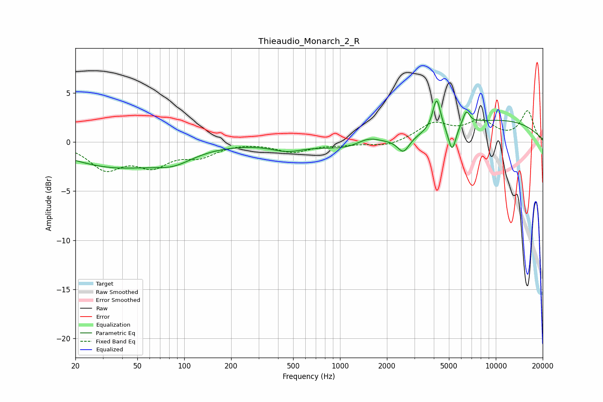

# Thieaudio_Monarch_2_R
See [usage instructions](https://github.com/jaakkopasanen/AutoEq#usage) for more options and info.

### Parametric EQs
Apply preamp of -4.3 dB when using parametric equalizer.

|   # | Type    |   Fc (Hz) |    Q |   Gain (dB) |
|-----|---------|-----------|------|-------------|
|   1 | Peaking |        36 | 0.46 |        -2.4 |
|   2 | Peaking |        86 | 1.12 |        -1.1 |
|   3 | Peaking |       457 | 1.41 |        -0.7 |
|   4 | Peaking |      1233 | 0.77 |        -0.9 |
|   5 | Peaking |      1514 | 1.82 |         0.9 |
|   6 | Peaking |      2554 | 3.72 |        -1.5 |
|   7 | Peaking |      4170 | 5.63 |         3.3 |
|   8 | Peaking |      5242 | 5.49 |        -2.7 |
|   9 | Peaking |      6458 | 5.93 |         1.4 |
|  10 | Peaking |     10000 | 0.32 |         2.2 |

### Fixed Band EQs
When using fixed band (also called graphic) equalizer, apply preamp of **-3.3 dB** (if available) and set gains manually with these parameters.

|   # | Type    |   Fc (Hz) |    Q |   Gain (dB) |
|-----|---------|-----------|------|-------------|
|   1 | Peaking |        31 | 1.41 |        -2.6 |
|   2 | Peaking |        62 | 1.41 |        -2.1 |
|   3 | Peaking |       125 | 1.41 |        -1.3 |
|   4 | Peaking |       250 | 1.41 |         0   |
|   5 | Peaking |       500 | 1.41 |        -1   |
|   6 | Peaking |      1000 | 1.41 |        -0.2 |
|   7 | Peaking |      2000 | 1.41 |        -0.5 |
|   8 | Peaking |      4000 | 1.41 |         1.8 |
|   9 | Peaking |      8000 | 1.41 |         1.9 |
|  10 | Peaking |     16000 | 1.41 |         3.1 |

### Graphs

