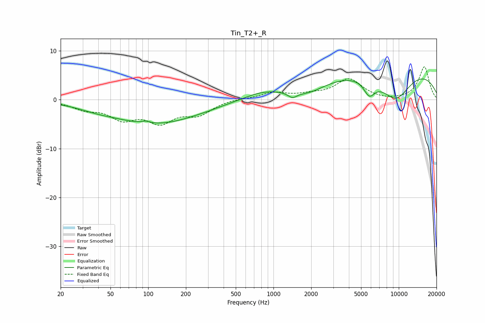

# Tin_T2+_R
See [usage instructions](https://github.com/jaakkopasanen/AutoEq#usage) for more options and info.

### Parametric EQs
Apply preamp of -4.4 dB when using parametric equalizer.

|   # | Type    |   Fc (Hz) |    Q |   Gain (dB) |
|-----|---------|-----------|------|-------------|
|   1 | Peaking |        38 | 1.01 |        -0.6 |
|   2 | Peaking |        96 | 4.52 |         0.4 |
|   3 | Peaking |       115 | 0.4  |        -4.8 |
|   4 | Peaking |       294 | 5.71 |        -0   |
|   5 | Peaking |       821 | 0.88 |         1.5 |
|   6 | Peaking |      1417 | 3.86 |        -1.1 |
|   7 | Peaking |      1950 | 1.26 |        -1.4 |
|   8 | Peaking |      5819 | 3.03 |        -3.2 |
|   9 | Peaking |      9060 | 0.22 |         7   |
|  10 | Peaking |      9455 | 0.99 |        -6.5 |

### Fixed Band EQs
When using fixed band (also called graphic) equalizer, apply preamp of **-6.8 dB** (if available) and set gains manually with these parameters.

|   # | Type    |   Fc (Hz) |    Q |   Gain (dB) |
|-----|---------|-----------|------|-------------|
|   1 | Peaking |        31 | 1.41 |        -1.6 |
|   2 | Peaking |        62 | 1.41 |        -3.4 |
|   3 | Peaking |       125 | 1.41 |        -4.1 |
|   4 | Peaking |       250 | 1.41 |        -2.7 |
|   5 | Peaking |       500 | 1.41 |         0.3 |
|   6 | Peaking |      1000 | 1.41 |         1.4 |
|   7 | Peaking |      2000 | 1.41 |         0.8 |
|   8 | Peaking |      4000 | 1.41 |         4.1 |
|   9 | Peaking |      8000 | 1.41 |        -0.3 |
|  10 | Peaking |     16000 | 1.41 |         6.7 |

### Graphs

