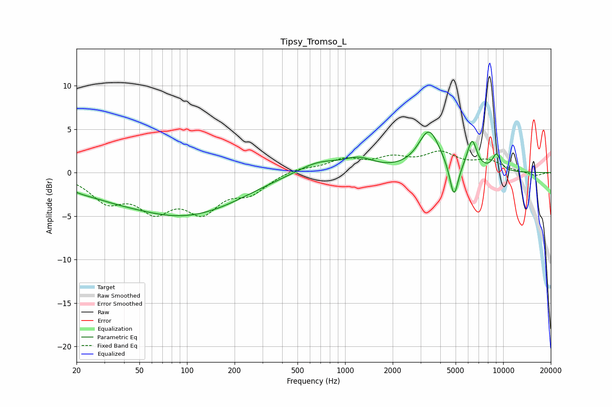

# Tipsy_Tromso_L
See [usage instructions](https://github.com/jaakkopasanen/AutoEq#usage) for more options and info.

### Parametric EQs
Apply preamp of -4.8 dB when using parametric equalizer.

|   # | Type    |   Fc (Hz) |    Q |   Gain (dB) |
|-----|---------|-----------|------|-------------|
|   1 | Peaking |        21 | 1.57 |        -0.5 |
|   2 | Peaking |        31 | 0.83 |        -0.8 |
|   3 | Peaking |        96 | 0.37 |        -4.9 |
|   4 | Peaking |       329 | 0.8  |         0.2 |
|   5 | Peaking |       675 | 1.03 |         1.4 |
|   6 | Peaking |      1223 | 1.49 |         1.3 |
|   7 | Peaking |      3397 | 2.07 |         4.7 |
|   8 | Peaking |      4881 | 5.28 |        -4.1 |
|   9 | Peaking |      6350 | 4.5  |         3.4 |
|  10 | Peaking |      9066 | 5.05 |         1.9 |

### Fixed Band EQs
When using fixed band (also called graphic) equalizer, apply preamp of **-2.6 dB** (if available) and set gains manually with these parameters.

|   # | Type    |   Fc (Hz) |    Q |   Gain (dB) |
|-----|---------|-----------|------|-------------|
|   1 | Peaking |        31 | 1.41 |        -2.9 |
|   2 | Peaking |        62 | 1.41 |        -3.7 |
|   3 | Peaking |       125 | 1.41 |        -3.9 |
|   4 | Peaking |       250 | 1.41 |        -2   |
|   5 | Peaking |       500 | 1.41 |         0.6 |
|   6 | Peaking |      1000 | 1.41 |         1.4 |
|   7 | Peaking |      2000 | 1.41 |         1.4 |
|   8 | Peaking |      4000 | 1.41 |         2   |
|   9 | Peaking |      8000 | 1.41 |         1.2 |
|  10 | Peaking |     16000 | 1.41 |        -0.4 |

### Graphs

