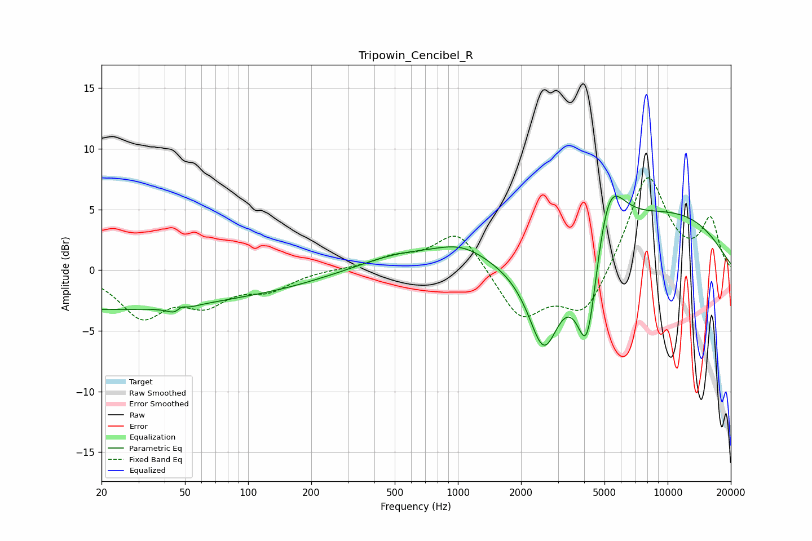

# Tripowin_Cencibel_R
See [usage instructions](https://github.com/jaakkopasanen/AutoEq#usage) for more options and info.

### Parametric EQs
Apply preamp of -6.2 dB when using parametric equalizer.

|   # | Type    |   Fc (Hz) |    Q |   Gain (dB) |
|-----|---------|-----------|------|-------------|
|   1 | Peaking |        20 | 0.2  |        -3.2 |
|   2 | Peaking |        47 | 4.1  |        -2.9 |
|   3 | Peaking |        48 | 4.73 |         2.6 |
|   4 | Peaking |       150 | 0.55 |        -0.7 |
|   5 | Peaking |       521 | 0.72 |         1.2 |
|   6 | Peaking |      1046 | 1.05 |         1.6 |
|   7 | Peaking |      2570 | 1.9  |        -7.2 |
|   8 | Peaking |      4137 | 2.65 |        -9.5 |
|   9 | Peaking |      5194 | 1.87 |         6.2 |
|  10 | Peaking |     10000 | 0.37 |         4.6 |

### Fixed Band EQs
When using fixed band (also called graphic) equalizer, apply preamp of **-7.7 dB** (if available) and set gains manually with these parameters.

|   # | Type    |   Fc (Hz) |    Q |   Gain (dB) |
|-----|---------|-----------|------|-------------|
|   1 | Peaking |        31 | 1.41 |        -3.6 |
|   2 | Peaking |        62 | 1.41 |        -2.4 |
|   3 | Peaking |       125 | 1.41 |        -1.4 |
|   4 | Peaking |       250 | 1.41 |         0.1 |
|   5 | Peaking |       500 | 1.41 |         0.9 |
|   6 | Peaking |      1000 | 1.41 |         3.4 |
|   7 | Peaking |      2000 | 1.41 |        -4   |
|   8 | Peaking |      4000 | 1.41 |        -3.8 |
|   9 | Peaking |      8000 | 1.41 |         8   |
|  10 | Peaking |     16000 | 1.41 |         4   |

### Graphs

