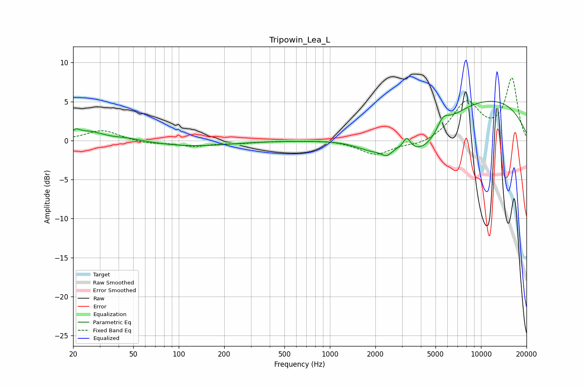

# Tripowin_Lea_L
See [usage instructions](https://github.com/jaakkopasanen/AutoEq#usage) for more options and info.

### Parametric EQs
Apply preamp of -5.1 dB when using parametric equalizer.

|   # | Type    |   Fc (Hz) |    Q |   Gain (dB) |
|-----|---------|-----------|------|-------------|
|   1 | Peaking |        21 | 5.89 |         0.7 |
|   2 | Peaking |        25 | 1.51 |         1.1 |
|   3 | Peaking |        46 | 1.64 |         0.3 |
|   4 | Peaking |       124 | 0.6  |        -0.7 |
|   5 | Peaking |      1919 | 1.25 |        -1.5 |
|   6 | Peaking |      2375 | 4.16 |        -0.9 |
|   7 | Peaking |      3232 | 5.95 |         1.5 |
|   8 | Peaking |      4145 | 0.9  |        -4.7 |
|   9 | Peaking |      5603 | 3.4  |         1.7 |
|  10 | Peaking |      9688 | 0.27 |         5.6 |

### Fixed Band EQs
When using fixed band (also called graphic) equalizer, apply preamp of **-8.1 dB** (if available) and set gains manually with these parameters.

|   # | Type    |   Fc (Hz) |    Q |   Gain (dB) |
|-----|---------|-----------|------|-------------|
|   1 | Peaking |        31 | 1.41 |         1.4 |
|   2 | Peaking |        62 | 1.41 |        -0.4 |
|   3 | Peaking |       125 | 1.41 |        -0.7 |
|   4 | Peaking |       250 | 1.41 |        -0.3 |
|   5 | Peaking |       500 | 1.41 |        -0   |
|   6 | Peaking |      1000 | 1.41 |         0.1 |
|   7 | Peaking |      2000 | 1.41 |        -1.8 |
|   8 | Peaking |      4000 | 1.41 |        -0.6 |
|   9 | Peaking |      8000 | 1.41 |         4.8 |
|  10 | Peaking |     16000 | 1.41 |         7.8 |

### Graphs

