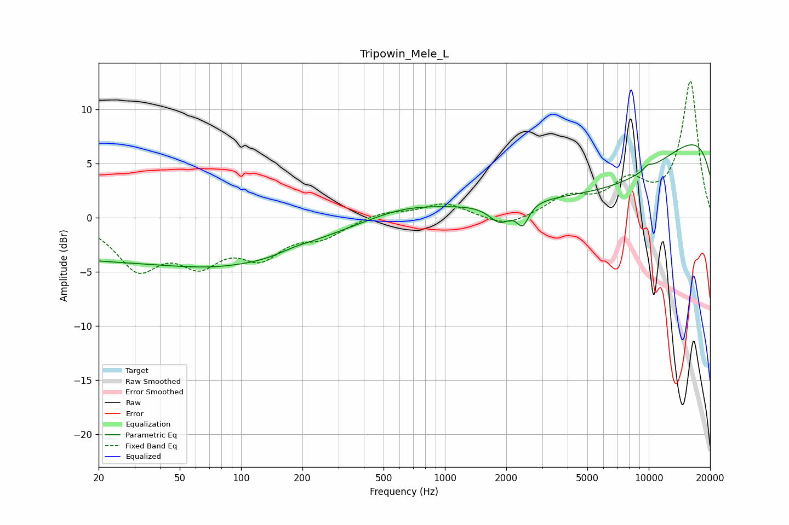

# Tripowin_Mele_L
See [usage instructions](https://github.com/jaakkopasanen/AutoEq#usage) for more options and info.

### Parametric EQs
Apply preamp of -6.8 dB when using parametric equalizer.

|   # | Type    |   Fc (Hz) |    Q |   Gain (dB) |
|-----|---------|-----------|------|-------------|
|   1 | Peaking |        23 | 0.18 |        -3.8 |
|   2 | Peaking |        96 | 1.6  |         0.1 |
|   3 | Peaking |       127 | 0.46 |        -2.1 |
|   4 | Peaking |       183 | 1.65 |         0.3 |
|   5 | Peaking |       634 | 0.81 |         0.9 |
|   6 | Peaking |      1858 | 2.64 |        -1.7 |
|   7 | Peaking |      2408 | 4.73 |        -1.9 |
|   8 | Peaking |      6809 | 0.3  |        -8.9 |
|   9 | Peaking |      9896 | 5.28 |         0.4 |
|  10 | Peaking |     10000 | 0.18 |        12.5 |

### Fixed Band EQs
When using fixed band (also called graphic) equalizer, apply preamp of **-12.7 dB** (if available) and set gains manually with these parameters.

|   # | Type    |   Fc (Hz) |    Q |   Gain (dB) |
|-----|---------|-----------|------|-------------|
|   1 | Peaking |        31 | 1.41 |        -4.3 |
|   2 | Peaking |        62 | 1.41 |        -3.5 |
|   3 | Peaking |       125 | 1.41 |        -3.1 |
|   4 | Peaking |       250 | 1.41 |        -1.5 |
|   5 | Peaking |       500 | 1.41 |         0.6 |
|   6 | Peaking |      1000 | 1.41 |         1.4 |
|   7 | Peaking |      2000 | 1.41 |        -1   |
|   8 | Peaking |      4000 | 1.41 |         1.8 |
|   9 | Peaking |      8000 | 1.41 |         2.9 |
|  10 | Peaking |     16000 | 1.41 |        12.6 |

### Graphs

