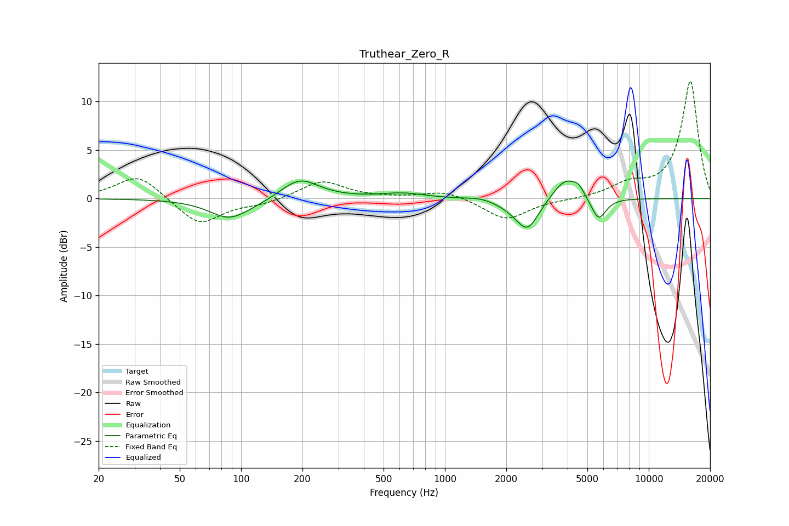

# Truthear_Zero_R
See [usage instructions](https://github.com/jaakkopasanen/AutoEq#usage) for more options and info.

### Parametric EQs
Apply preamp of -1.9 dB when using parametric equalizer.

|   # | Type    |   Fc (Hz) |    Q |   Gain (dB) |
|-----|---------|-----------|------|-------------|
|   1 | Peaking |        87 | 1.46 |        -2   |
|   2 | Peaking |       129 | 1.13 |        -0.4 |
|   3 | Peaking |       193 | 1.49 |         2.2 |
|   4 | Peaking |       621 | 1.32 |         0.5 |
|   5 | Peaking |      1475 | 2.43 |         0.2 |
|   6 | Peaking |      2178 | 2.04 |        -0.6 |
|   7 | Peaking |      2549 | 2.64 |        -3   |
|   8 | Peaking |      3885 | 2.38 |         2.2 |
|   9 | Peaking |      4523 | 5    |         0.9 |
|  10 | Peaking |      5679 | 3.84 |        -2.3 |

### Fixed Band EQs
When using fixed band (also called graphic) equalizer, apply preamp of **-12.2 dB** (if available) and set gains manually with these parameters.

|   # | Type    |   Fc (Hz) |    Q |   Gain (dB) |
|-----|---------|-----------|------|-------------|
|   1 | Peaking |        31 | 1.41 |         2.5 |
|   2 | Peaking |        62 | 1.41 |        -2.8 |
|   3 | Peaking |       125 | 1.41 |        -0.5 |
|   4 | Peaking |       250 | 1.41 |         1.9 |
|   5 | Peaking |       500 | 1.41 |         0   |
|   6 | Peaking |      1000 | 1.41 |         0.8 |
|   7 | Peaking |      2000 | 1.41 |        -2.2 |
|   8 | Peaking |      4000 | 1.41 |        -0.1 |
|   9 | Peaking |      8000 | 1.41 |         1.3 |
|  10 | Peaking |     16000 | 1.41 |        12.1 |

### Graphs

