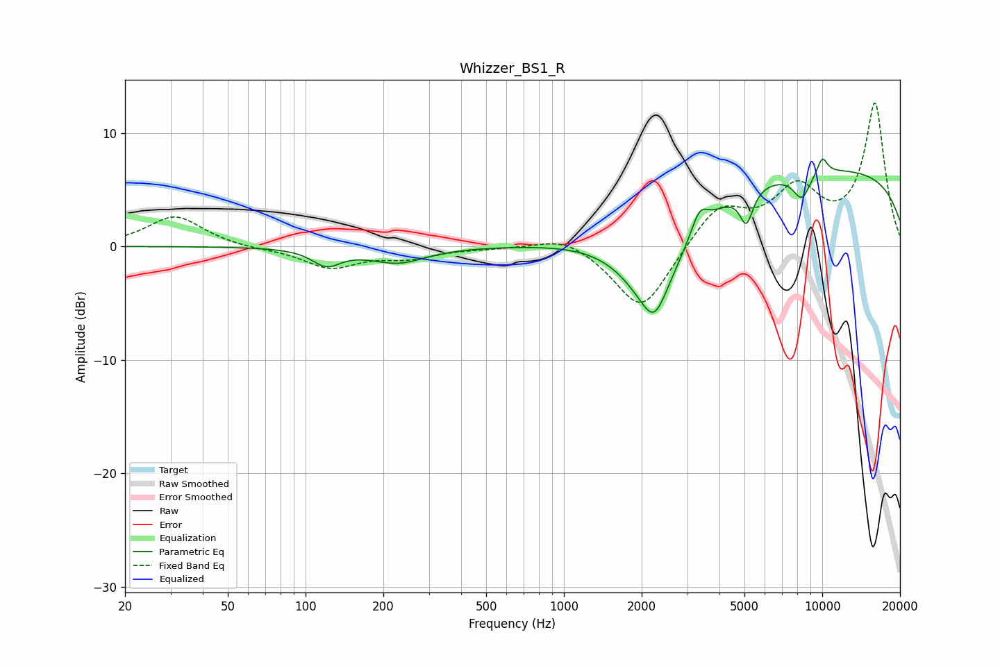

# Whizzer_BS1_R
See [usage instructions](https://github.com/jaakkopasanen/AutoEq#usage) for more options and info.

### Parametric EQs
Apply preamp of -7.8 dB when using parametric equalizer.

|   # | Type    |   Fc (Hz) |    Q |   Gain (dB) |
|-----|---------|-----------|------|-------------|
|   1 | Peaking |       121 | 2.59 |        -1.5 |
|   2 | Peaking |       227 | 1.29 |        -1.4 |
|   3 | Peaking |      2218 | 1.23 |        -7.5 |
|   4 | Peaking |      2238 | 3.48 |        -1.9 |
|   5 | Peaking |      3350 | 4.52 |         1.9 |
|   6 | Peaking |      5088 | 5.59 |        -2.9 |
|   7 | Peaking |      6092 | 5.84 |         0   |
|   8 | Peaking |      8340 | 3.87 |        -2.3 |
|   9 | Peaking |     10000 | 0.19 |         6.9 |
|  10 | Peaking |     10000 | 6    |         1.5 |

### Fixed Band EQs
When using fixed band (also called graphic) equalizer, apply preamp of **-12.7 dB** (if available) and set gains manually with these parameters.

|   # | Type    |   Fc (Hz) |    Q |   Gain (dB) |
|-----|---------|-----------|------|-------------|
|   1 | Peaking |        31 | 1.41 |         2.7 |
|   2 | Peaking |        62 | 1.41 |        -0.2 |
|   3 | Peaking |       125 | 1.41 |        -1.8 |
|   4 | Peaking |       250 | 1.41 |        -0.9 |
|   5 | Peaking |       500 | 1.41 |        -0.1 |
|   6 | Peaking |      1000 | 1.41 |         1.1 |
|   7 | Peaking |      2000 | 1.41 |        -5.9 |
|   8 | Peaking |      4000 | 1.41 |         3.5 |
|   9 | Peaking |      8000 | 1.41 |         4.6 |
|  10 | Peaking |     16000 | 1.41 |        12.5 |

### Graphs

