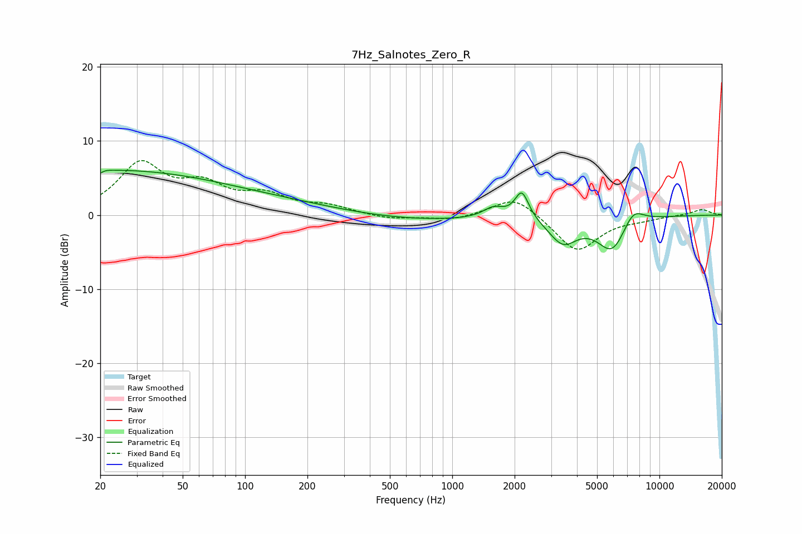

# 7Hz_Salnotes_Zero_R
See [usage instructions](https://github.com/jaakkopasanen/AutoEq#usage) for more options and info.

### Parametric EQs
Apply preamp of -6.2 dB when using parametric equalizer.

|   # | Type    |   Fc (Hz) |    Q |   Gain (dB) |
|-----|---------|-----------|------|-------------|
|   1 | Peaking |        20 | 5.86 |        -3.8 |
|   2 | Peaking |        20 | 5.57 |         3.5 |
|   3 | Peaking |        20 | 0.27 |         5.7 |
|   4 | Peaking |       128 | 0.37 |         1.5 |
|   5 | Peaking |       615 | 0.41 |        -0.8 |
|   6 | Peaking |      1583 | 2.8  |         1.4 |
|   7 | Peaking |      2167 | 4.22 |         3.8 |
|   8 | Peaking |      3423 | 2.08 |        -3.4 |
|   9 | Peaking |      5928 | 1.9  |        -4.9 |
|  10 | Peaking |      7438 | 2.56 |         2.5 |

### Fixed Band EQs
When using fixed band (also called graphic) equalizer, apply preamp of **-7.5 dB** (if available) and set gains manually with these parameters.

|   # | Type    |   Fc (Hz) |    Q |   Gain (dB) |
|-----|---------|-----------|------|-------------|
|   1 | Peaking |        31 | 1.41 |         6.6 |
|   2 | Peaking |        62 | 1.41 |         3.4 |
|   3 | Peaking |       125 | 1.41 |         2.3 |
|   4 | Peaking |       250 | 1.41 |         1.1 |
|   5 | Peaking |       500 | 1.41 |        -0.6 |
|   6 | Peaking |      1000 | 1.41 |        -0.7 |
|   7 | Peaking |      2000 | 1.41 |         2.7 |
|   8 | Peaking |      4000 | 1.41 |        -5   |
|   9 | Peaking |      8000 | 1.41 |        -0.4 |
|  10 | Peaking |     16000 | 1.41 |         0.8 |

### Graphs

