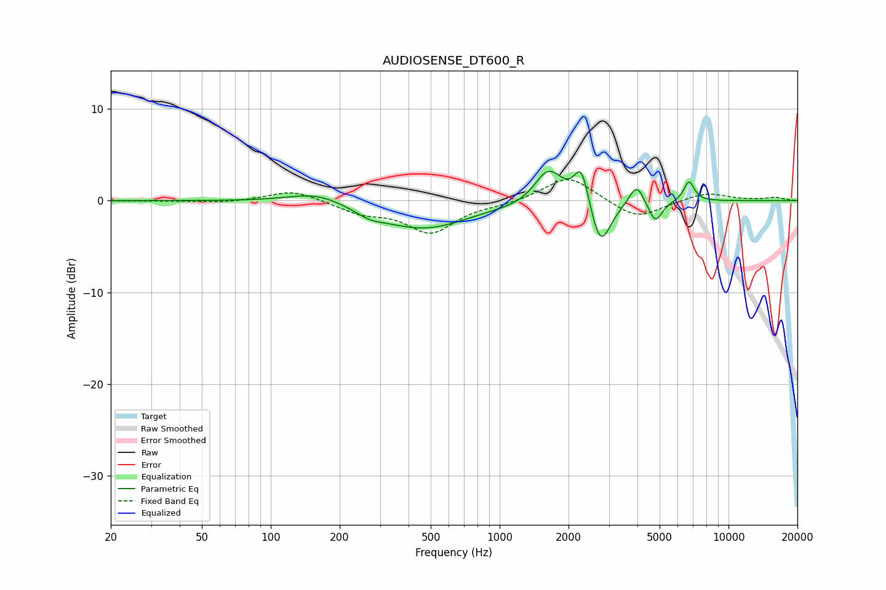

# AUDIOSENSE_DT600_R
See [usage instructions](https://github.com/jaakkopasanen/AutoEq#usage) for more options and info.

### Parametric EQs
Apply preamp of -3.3 dB when using parametric equalizer.

|   # | Type    |   Fc (Hz) |    Q |   Gain (dB) |
|-----|---------|-----------|------|-------------|
|   1 | Peaking |       159 | 1.15 |         1.2 |
|   2 | Peaking |       271 | 2.25 |        -0.7 |
|   3 | Peaking |       463 | 0.72 |        -3   |
|   4 | Peaking |      1417 | 1.41 |        -0.6 |
|   5 | Peaking |      1628 | 2.2  |         4.2 |
|   6 | Peaking |      2279 | 4.54 |         4.2 |
|   7 | Peaking |      2760 | 3.19 |        -5.3 |
|   8 | Peaking |      3969 | 4.54 |         2.3 |
|   9 | Peaking |      4793 | 4.78 |        -2.4 |
|  10 | Peaking |      6725 | 6    |         2.2 |

### Fixed Band EQs
When using fixed band (also called graphic) equalizer, apply preamp of **-2.4 dB** (if available) and set gains manually with these parameters.

|   # | Type    |   Fc (Hz) |    Q |   Gain (dB) |
|-----|---------|-----------|------|-------------|
|   1 | Peaking |        31 | 1.41 |        -0   |
|   2 | Peaking |        62 | 1.41 |        -0.2 |
|   3 | Peaking |       125 | 1.41 |         1.2 |
|   4 | Peaking |       250 | 1.41 |        -1.2 |
|   5 | Peaking |       500 | 1.41 |        -3.4 |
|   6 | Peaking |      1000 | 1.41 |        -0.3 |
|   7 | Peaking |      2000 | 1.41 |         2.8 |
|   8 | Peaking |      4000 | 1.41 |        -2   |
|   9 | Peaking |      8000 | 1.41 |         0.9 |
|  10 | Peaking |     16000 | 1.41 |         0.3 |

### Graphs

