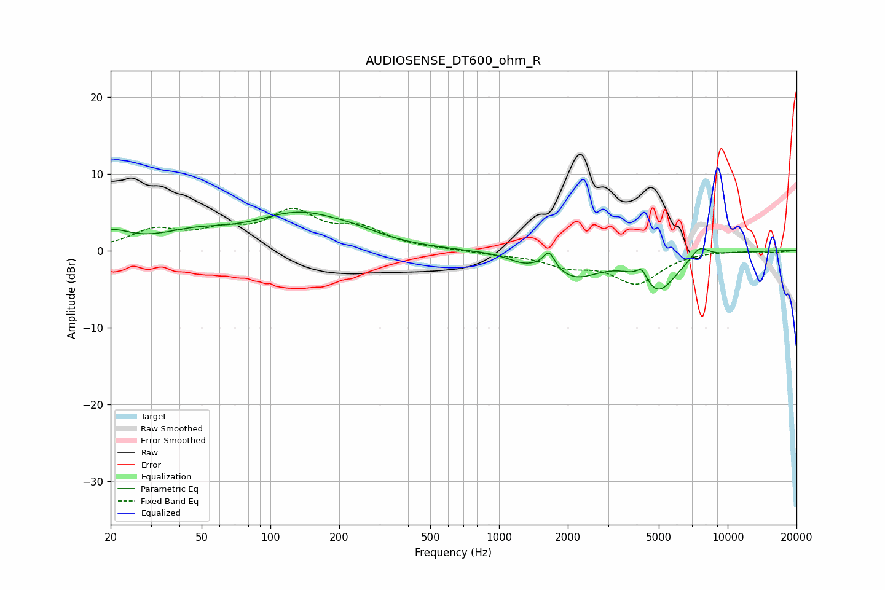

# AUDIOSENSE_DT600_ohm_R
See [usage instructions](https://github.com/jaakkopasanen/AutoEq#usage) for more options and info.

### Parametric EQs
Apply preamp of -5.1 dB when using parametric equalizer.

|   # | Type    |   Fc (Hz) |    Q |   Gain (dB) |
|-----|---------|-----------|------|-------------|
|   1 | Peaking |        20 | 1.72 |         2.1 |
|   2 | Peaking |        46 | 0.92 |         1.8 |
|   3 | Peaking |       134 | 0.7  |         4.4 |
|   4 | Peaking |       235 | 1.18 |         0.8 |
|   5 | Peaking |      1262 | 2.32 |        -0.8 |
|   6 | Peaking |      1655 | 5.72 |         2.2 |
|   7 | Peaking |      2140 | 1.28 |        -3.2 |
|   8 | Peaking |      4216 | 5.98 |         1.7 |
|   9 | Peaking |      4958 | 1.71 |        -5   |
|  10 | Peaking |      7535 | 3.48 |         1.6 |

### Fixed Band EQs
When using fixed band (also called graphic) equalizer, apply preamp of **-5.6 dB** (if available) and set gains manually with these parameters.

|   # | Type    |   Fc (Hz) |    Q |   Gain (dB) |
|-----|---------|-----------|------|-------------|
|   1 | Peaking |        31 | 1.41 |         2.5 |
|   2 | Peaking |        62 | 1.41 |         2   |
|   3 | Peaking |       125 | 1.41 |         4.6 |
|   4 | Peaking |       250 | 1.41 |         2.5 |
|   5 | Peaking |       500 | 1.41 |         0.1 |
|   6 | Peaking |      1000 | 1.41 |        -0.4 |
|   7 | Peaking |      2000 | 1.41 |        -1.7 |
|   8 | Peaking |      4000 | 1.41 |        -4.1 |
|   9 | Peaking |      8000 | 1.41 |         0.1 |
|  10 | Peaking |     16000 | 1.41 |        -0.2 |

### Graphs

