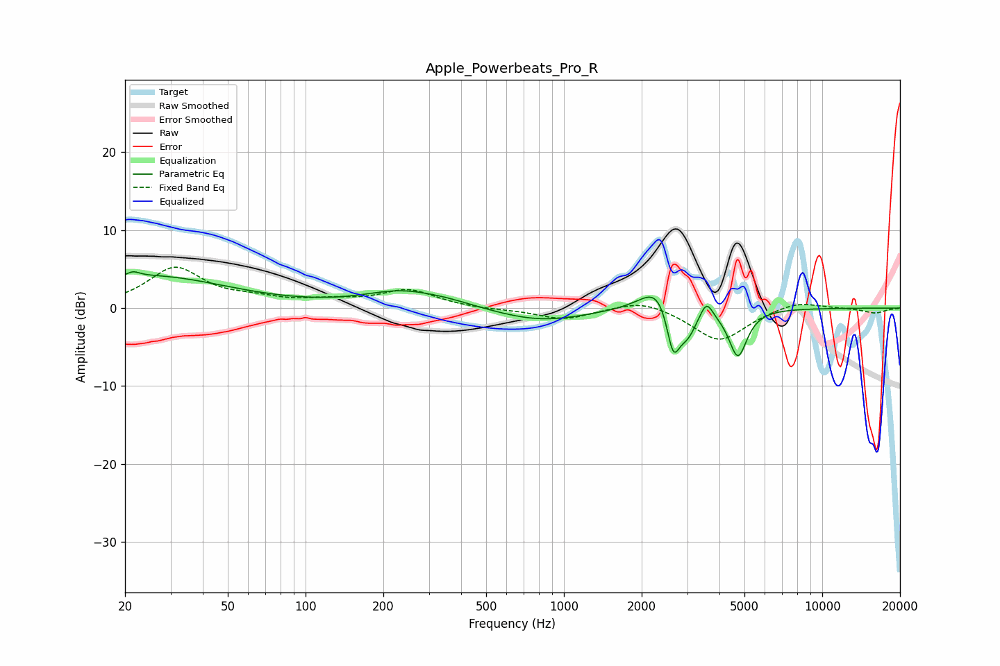

# Apple_Powerbeats_Pro_R
See [usage instructions](https://github.com/jaakkopasanen/AutoEq#usage) for more options and info.

### Parametric EQs
Apply preamp of -4.7 dB when using parametric equalizer.

|   # | Type    |   Fc (Hz) |    Q |   Gain (dB) |
|-----|---------|-----------|------|-------------|
|   1 | Peaking |        21 | 5.81 |         0.6 |
|   2 | Peaking |        25 | 0.47 |         4.1 |
|   3 | Peaking |       234 | 0.96 |         2   |
|   4 | Peaking |       356 | 1.22 |         0.6 |
|   5 | Peaking |       816 | 0.8  |        -1.7 |
|   6 | Peaking |      2343 | 2.11 |         3.8 |
|   7 | Peaking |      2649 | 5.26 |        -6.6 |
|   8 | Peaking |      3010 | 3.9  |        -3.3 |
|   9 | Peaking |      3563 | 6    |         2.2 |
|  10 | Peaking |      4716 | 4    |        -6.2 |

### Fixed Band EQs
When using fixed band (also called graphic) equalizer, apply preamp of **-5.3 dB** (if available) and set gains manually with these parameters.

|   # | Type    |   Fc (Hz) |    Q |   Gain (dB) |
|-----|---------|-----------|------|-------------|
|   1 | Peaking |        31 | 1.41 |         5   |
|   2 | Peaking |        62 | 1.41 |         0.9 |
|   3 | Peaking |       125 | 1.41 |         0.7 |
|   4 | Peaking |       250 | 1.41 |         2.2 |
|   5 | Peaking |       500 | 1.41 |        -0.2 |
|   6 | Peaking |      1000 | 1.41 |        -1.5 |
|   7 | Peaking |      2000 | 1.41 |         1.3 |
|   8 | Peaking |      4000 | 1.41 |        -4.3 |
|   9 | Peaking |      8000 | 1.41 |         1   |
|  10 | Peaking |     16000 | 1.41 |        -0.6 |

### Graphs

