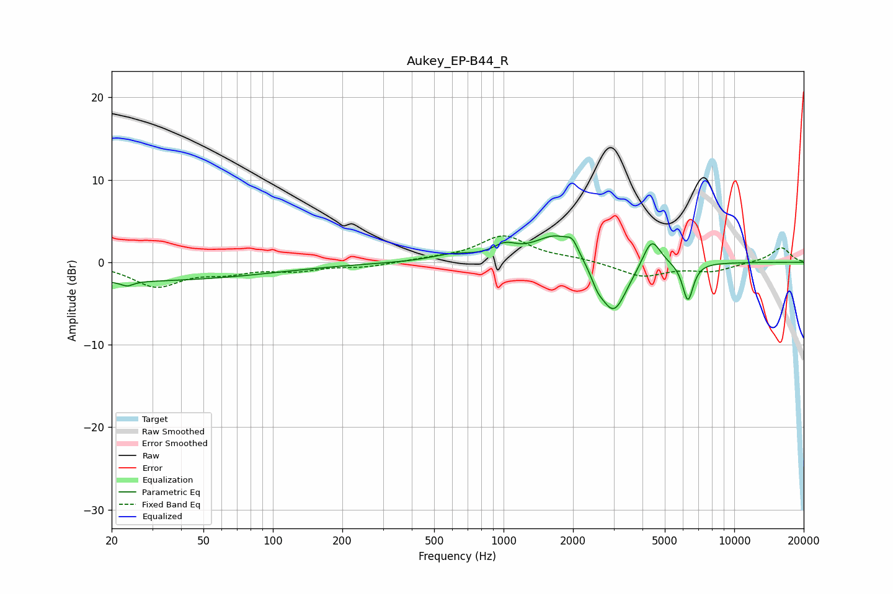

# Aukey_EP-B44_R
See [usage instructions](https://github.com/jaakkopasanen/AutoEq#usage) for more options and info.

### Parametric EQs
Apply preamp of -3.3 dB when using parametric equalizer.

|   # | Type    |   Fc (Hz) |    Q |   Gain (dB) |
|-----|---------|-----------|------|-------------|
|   1 | Peaking |        20 | 0.18 |        -2.3 |
|   2 | Peaking |        23 | 5.45 |        -0.6 |
|   3 | Peaking |       602 | 1.51 |         0.8 |
|   4 | Peaking |      1011 | 2.74 |         1.4 |
|   5 | Peaking |      1706 | 1.47 |         3.5 |
|   6 | Peaking |      1987 | 6    |         1.2 |
|   7 | Peaking |      2549 | 5.32 |        -1.3 |
|   8 | Peaking |      2995 | 2.33 |        -6.6 |
|   9 | Peaking |      4384 | 3.59 |         3.6 |
|  10 | Peaking |      6296 | 5.97 |        -4.7 |

### Fixed Band EQs
When using fixed band (also called graphic) equalizer, apply preamp of **-3.3 dB** (if available) and set gains manually with these parameters.

|   # | Type    |   Fc (Hz) |    Q |   Gain (dB) |
|-----|---------|-----------|------|-------------|
|   1 | Peaking |        31 | 1.41 |        -2.8 |
|   2 | Peaking |        62 | 1.41 |        -1   |
|   3 | Peaking |       125 | 1.41 |        -0.9 |
|   4 | Peaking |       250 | 1.41 |        -0.5 |
|   5 | Peaking |       500 | 1.41 |         0.3 |
|   6 | Peaking |      1000 | 1.41 |         3.1 |
|   7 | Peaking |      2000 | 1.41 |         0.4 |
|   8 | Peaking |      4000 | 1.41 |        -1.7 |
|   9 | Peaking |      8000 | 1.41 |        -1   |
|  10 | Peaking |     16000 | 1.41 |         1.8 |

### Graphs

