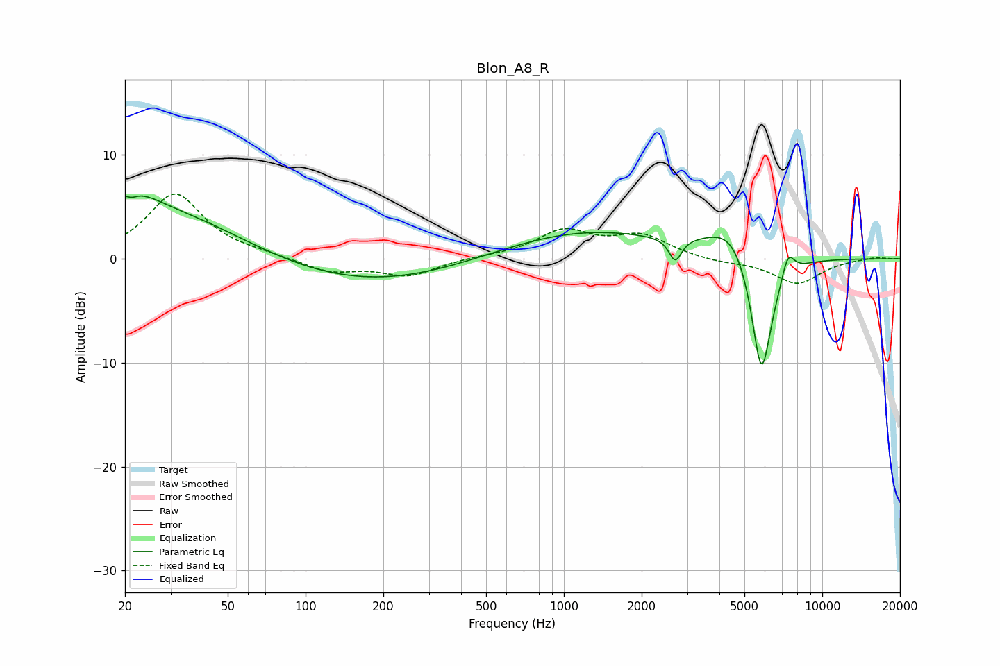

# Blon_A8_R
See [usage instructions](https://github.com/jaakkopasanen/AutoEq#usage) for more options and info.

### Parametric EQs
Apply preamp of -6.1 dB when using parametric equalizer.

|   # | Type    |   Fc (Hz) |    Q |   Gain (dB) |
|-----|---------|-----------|------|-------------|
|   1 | Peaking |        21 | 5.81 |         3.1 |
|   2 | Peaking |        21 | 5.88 |        -3.2 |
|   3 | Peaking |        22 | 1.66 |         1.6 |
|   4 | Peaking |        26 | 0.4  |         5   |
|   5 | Peaking |       159 | 0.35 |        -2.7 |
|   6 | Peaking |      1191 | 0.42 |         2.8 |
|   7 | Peaking |      2699 | 5.98 |        -2.2 |
|   8 | Peaking |      4606 | 1.42 |         3.9 |
|   9 | Peaking |      5817 | 3.05 |       -13.4 |
|  10 | Peaking |      7370 | 5.4  |         2.5 |

### Fixed Band EQs
When using fixed band (also called graphic) equalizer, apply preamp of **-6.3 dB** (if available) and set gains manually with these parameters.

|   # | Type    |   Fc (Hz) |    Q |   Gain (dB) |
|-----|---------|-----------|------|-------------|
|   1 | Peaking |        31 | 1.41 |         6.2 |
|   2 | Peaking |        62 | 1.41 |         0.3 |
|   3 | Peaking |       125 | 1.41 |        -1.3 |
|   4 | Peaking |       250 | 1.41 |        -1.6 |
|   5 | Peaking |       500 | 1.41 |         0.2 |
|   6 | Peaking |      1000 | 1.41 |         2.6 |
|   7 | Peaking |      2000 | 1.41 |         2.1 |
|   8 | Peaking |      4000 | 1.41 |        -0.3 |
|   9 | Peaking |      8000 | 1.41 |        -2.4 |
|  10 | Peaking |     16000 | 1.41 |         0.2 |

### Graphs

