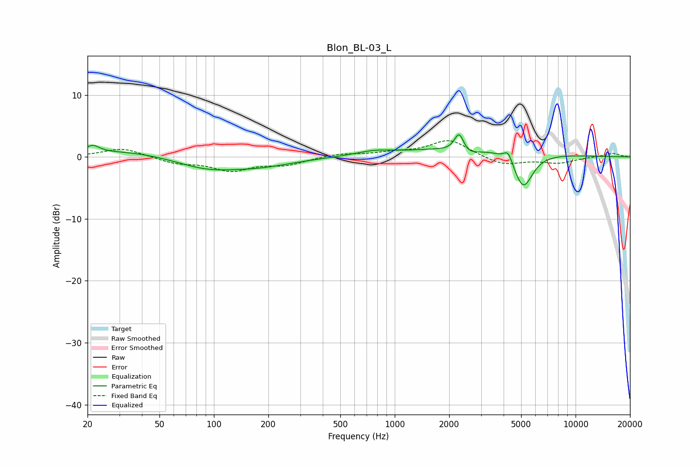

# Blon_BL-03_L
See [usage instructions](https://github.com/jaakkopasanen/AutoEq#usage) for more options and info.

### Parametric EQs
Apply preamp of -3.7 dB when using parametric equalizer.

|   # | Type    |   Fc (Hz) |    Q |   Gain (dB) |
|-----|---------|-----------|------|-------------|
|   1 | Peaking |        21 | 3.71 |         1.3 |
|   2 | Peaking |        33 | 0.6  |         1   |
|   3 | Peaking |        91 | 0.83 |        -1.7 |
|   4 | Peaking |       181 | 0.74 |        -1.3 |
|   5 | Peaking |       767 | 1.39 |         0.7 |
|   6 | Peaking |      2275 | 5.1  |         3.7 |
|   7 | Peaking |      2424 | 2.39 |        -1.7 |
|   8 | Peaking |      2746 | 0.43 |         1.7 |
|   9 | Peaking |      4241 | 6    |         1.8 |
|  10 | Peaking |      5137 | 2.63 |        -5.9 |

### Fixed Band EQs
When using fixed band (also called graphic) equalizer, apply preamp of **-2.7 dB** (if available) and set gains manually with these parameters.

|   # | Type    |   Fc (Hz) |    Q |   Gain (dB) |
|-----|---------|-----------|------|-------------|
|   1 | Peaking |        31 | 1.41 |         1.5 |
|   2 | Peaking |        62 | 1.41 |        -1   |
|   3 | Peaking |       125 | 1.41 |        -2.1 |
|   4 | Peaking |       250 | 1.41 |        -1.2 |
|   5 | Peaking |       500 | 1.41 |         0.5 |
|   6 | Peaking |      1000 | 1.41 |         0.6 |
|   7 | Peaking |      2000 | 1.41 |         2.8 |
|   8 | Peaking |      4000 | 1.41 |        -1.4 |
|   9 | Peaking |      8000 | 1.41 |        -0.9 |
|  10 | Peaking |     16000 | 1.41 |         0.6 |

### Graphs

