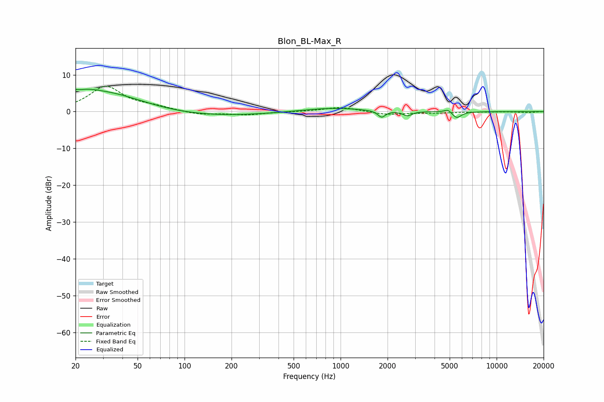

# Blon_BL-Max_R
See [usage instructions](https://github.com/jaakkopasanen/AutoEq#usage) for more options and info.

### Parametric EQs
Apply preamp of -6.2 dB when using parametric equalizer.

|   # | Type    |   Fc (Hz) |    Q |   Gain (dB) |
|-----|---------|-----------|------|-------------|
|   1 | Peaking |        20 | 5.78 |         3.3 |
|   2 | Peaking |        20 | 5.82 |        -2.6 |
|   3 | Peaking |        23 | 1.74 |         1.4 |
|   4 | Peaking |        31 | 0.54 |         5.5 |
|   5 | Peaking |       112 | 0.33 |        -1.6 |
|   6 | Peaking |       877 | 0.73 |         1.1 |
|   7 | Peaking |      1832 | 5.98 |        -1.8 |
|   8 | Peaking |      2682 | 4.98 |        -1.2 |
|   9 | Peaking |      4891 | 6    |         1   |
|  10 | Peaking |      5532 | 4.58 |        -1.8 |

### Fixed Band EQs
When using fixed band (also called graphic) equalizer, apply preamp of **-7.0 dB** (if available) and set gains manually with these parameters.

|   # | Type    |   Fc (Hz) |    Q |   Gain (dB) |
|-----|---------|-----------|------|-------------|
|   1 | Peaking |        31 | 1.41 |         6.7 |
|   2 | Peaking |        62 | 1.41 |         1   |
|   3 | Peaking |       125 | 1.41 |        -0.9 |
|   4 | Peaking |       250 | 1.41 |        -0.8 |
|   5 | Peaking |       500 | 1.41 |        -0   |
|   6 | Peaking |      1000 | 1.41 |         1.3 |
|   7 | Peaking |      2000 | 1.41 |        -0.8 |
|   8 | Peaking |      4000 | 1.41 |        -0.4 |
|   9 | Peaking |      8000 | 1.41 |        -0.1 |
|  10 | Peaking |     16000 | 1.41 |        -0.3 |

### Graphs

