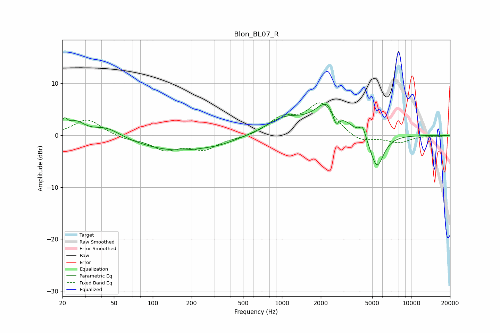

# Blon_BL07_R
See [usage instructions](https://github.com/jaakkopasanen/AutoEq#usage) for more options and info.

### Parametric EQs
Apply preamp of -6.1 dB when using parametric equalizer.

|   # | Type    |   Fc (Hz) |    Q |   Gain (dB) |
|-----|---------|-----------|------|-------------|
|   1 | Peaking |        21 | 5.95 |         2   |
|   2 | Peaking |        25 | 2.14 |         2.3 |
|   3 | Peaking |        44 | 1.32 |         1.9 |
|   4 | Peaking |       151 | 0.47 |        -2.9 |
|   5 | Peaking |       336 | 1.12 |        -0.5 |
|   6 | Peaking |      1041 | 1.02 |         3   |
|   7 | Peaking |      2315 | 1.38 |         6.4 |
|   8 | Peaking |      2614 | 4.82 |        -3.5 |
|   9 | Peaking |      4220 | 6    |         2.1 |
|  10 | Peaking |      5435 | 2.61 |        -6.7 |

### Fixed Band EQs
When using fixed band (also called graphic) equalizer, apply preamp of **-6.3 dB** (if available) and set gains manually with these parameters.

|   # | Type    |   Fc (Hz) |    Q |   Gain (dB) |
|-----|---------|-----------|------|-------------|
|   1 | Peaking |        31 | 1.41 |         3.2 |
|   2 | Peaking |        62 | 1.41 |        -0.7 |
|   3 | Peaking |       125 | 1.41 |        -2.6 |
|   4 | Peaking |       250 | 1.41 |        -2.5 |
|   5 | Peaking |       500 | 1.41 |        -0.5 |
|   6 | Peaking |      1000 | 1.41 |         3   |
|   7 | Peaking |      2000 | 1.41 |         6   |
|   8 | Peaking |      4000 | 1.41 |        -1.6 |
|   9 | Peaking |      8000 | 1.41 |        -1.4 |
|  10 | Peaking |     16000 | 1.41 |        -0.2 |

### Graphs

