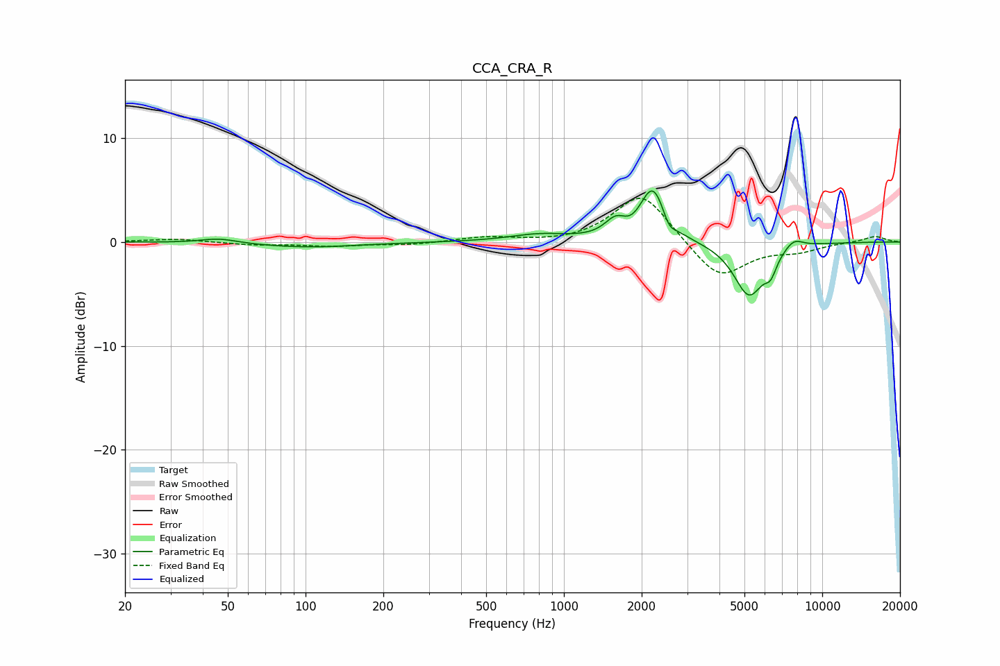

# CCA_CRA_R
See [usage instructions](https://github.com/jaakkopasanen/AutoEq#usage) for more options and info.

### Parametric EQs
Apply preamp of -5.0 dB when using parametric equalizer.

|   # | Type    |   Fc (Hz) |    Q |   Gain (dB) |
|-----|---------|-----------|------|-------------|
|   1 | Peaking |        46 | 2.06 |         0.5 |
|   2 | Peaking |       101 | 0.71 |        -0.5 |
|   3 | Peaking |       803 | 1.23 |         0.7 |
|   4 | Peaking |      1587 | 3.4  |         1.6 |
|   5 | Peaking |      1816 | 3.98 |        -0.4 |
|   6 | Peaking |      2211 | 2.86 |         5.2 |
|   7 | Peaking |      2553 | 6    |        -1.1 |
|   8 | Peaking |      5207 | 2.35 |        -5.2 |
|   9 | Peaking |      6317 | 6    |        -1.5 |
|  10 | Peaking |      7748 | 3.56 |         1   |

### Fixed Band EQs
When using fixed band (also called graphic) equalizer, apply preamp of **-4.3 dB** (if available) and set gains manually with these parameters.

|   # | Type    |   Fc (Hz) |    Q |   Gain (dB) |
|-----|---------|-----------|------|-------------|
|   1 | Peaking |        31 | 1.41 |         0.3 |
|   2 | Peaking |        62 | 1.41 |        -0.3 |
|   3 | Peaking |       125 | 1.41 |        -0.4 |
|   4 | Peaking |       250 | 1.41 |        -0.3 |
|   5 | Peaking |       500 | 1.41 |         0.5 |
|   6 | Peaking |      1000 | 1.41 |        -0.2 |
|   7 | Peaking |      2000 | 1.41 |         4.9 |
|   8 | Peaking |      4000 | 1.41 |        -3.7 |
|   9 | Peaking |      8000 | 1.41 |        -0.8 |
|  10 | Peaking |     16000 | 1.41 |         0.6 |

### Graphs

