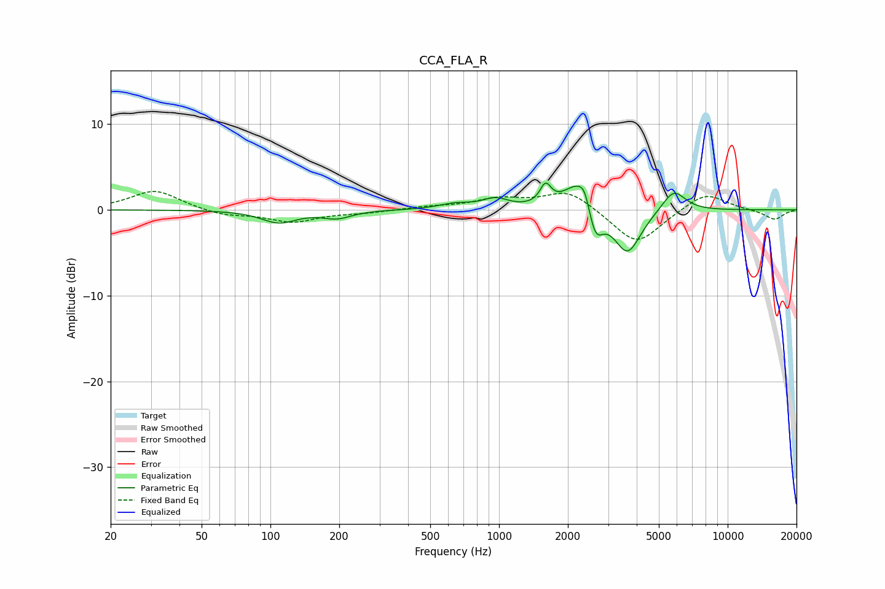

# CCA_FLA_R
See [usage instructions](https://github.com/jaakkopasanen/AutoEq#usage) for more options and info.

### Parametric EQs
Apply preamp of -3.2 dB when using parametric equalizer.

|   # | Type    |   Fc (Hz) |    Q |   Gain (dB) |
|-----|---------|-----------|------|-------------|
|   1 | Peaking |       109 | 1.85 |        -1.4 |
|   2 | Peaking |       196 | 2.24 |        -0.9 |
|   3 | Peaking |       642 | 1.99 |         0.6 |
|   4 | Peaking |       964 | 2.48 |         1.1 |
|   5 | Peaking |      1597 | 5.89 |         2.3 |
|   6 | Peaking |      2215 | 2.25 |         3.5 |
|   7 | Peaking |      2372 | 6    |         1.7 |
|   8 | Peaking |      2630 | 4.16 |        -4   |
|   9 | Peaking |      3645 | 2.38 |        -5.2 |
|  10 | Peaking |      5809 | 2.71 |         2.6 |

### Fixed Band EQs
When using fixed band (also called graphic) equalizer, apply preamp of **-2.2 dB** (if available) and set gains manually with these parameters.

|   # | Type    |   Fc (Hz) |    Q |   Gain (dB) |
|-----|---------|-----------|------|-------------|
|   1 | Peaking |        31 | 1.41 |         2.3 |
|   2 | Peaking |        62 | 1.41 |        -0.7 |
|   3 | Peaking |       125 | 1.41 |        -1.4 |
|   4 | Peaking |       250 | 1.41 |        -0.3 |
|   5 | Peaking |       500 | 1.41 |         0.3 |
|   6 | Peaking |      1000 | 1.41 |         1.2 |
|   7 | Peaking |      2000 | 1.41 |         2.3 |
|   8 | Peaking |      4000 | 1.41 |        -4.2 |
|   9 | Peaking |      8000 | 1.41 |         2.1 |
|  10 | Peaking |     16000 | 1.41 |        -1.1 |

### Graphs

