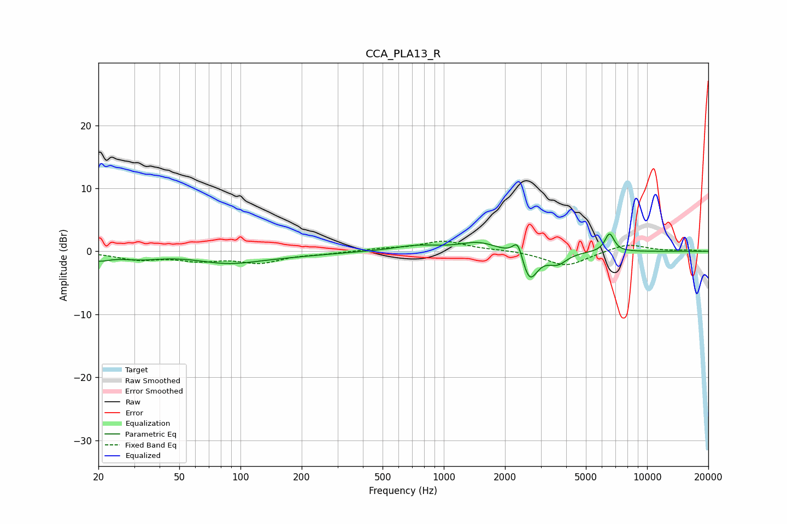

# CCA_PLA13_R
See [usage instructions](https://github.com/jaakkopasanen/AutoEq#usage) for more options and info.

### Parametric EQs
Apply preamp of -2.8 dB when using parametric equalizer.

|   # | Type    |   Fc (Hz) |    Q |   Gain (dB) |
|-----|---------|-----------|------|-------------|
|   1 | Peaking |        20 | 2.56 |        -1.1 |
|   2 | Peaking |        32 | 1.34 |        -0.9 |
|   3 | Peaking |        86 | 0.96 |        -1.4 |
|   4 | Peaking |       143 | 0.57 |        -0.7 |
|   5 | Peaking |       741 | 1.21 |         0.9 |
|   6 | Peaking |      1482 | 1.57 |         1.4 |
|   7 | Peaking |      2314 | 5.89 |         3   |
|   8 | Peaking |      2638 | 3.66 |        -4.8 |
|   9 | Peaking |      3621 | 3.04 |        -1.8 |
|  10 | Peaking |      6535 | 6    |         2.9 |

### Fixed Band EQs
When using fixed band (also called graphic) equalizer, apply preamp of **-1.7 dB** (if available) and set gains manually with these parameters.

|   # | Type    |   Fc (Hz) |    Q |   Gain (dB) |
|-----|---------|-----------|------|-------------|
|   1 | Peaking |        31 | 1.41 |        -1.2 |
|   2 | Peaking |        62 | 1.41 |        -1.2 |
|   3 | Peaking |       125 | 1.41 |        -1.6 |
|   4 | Peaking |       250 | 1.41 |        -0.3 |
|   5 | Peaking |       500 | 1.41 |         0.4 |
|   6 | Peaking |      1000 | 1.41 |         1.6 |
|   7 | Peaking |      2000 | 1.41 |         0.2 |
|   8 | Peaking |      4000 | 1.41 |        -2.4 |
|   9 | Peaking |      8000 | 1.41 |         1.3 |
|  10 | Peaking |     16000 | 1.41 |         0.2 |

### Graphs

